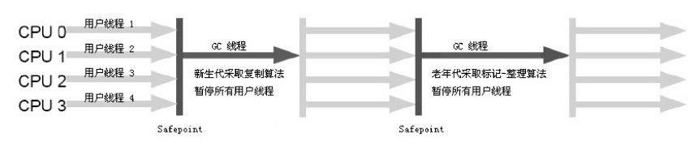
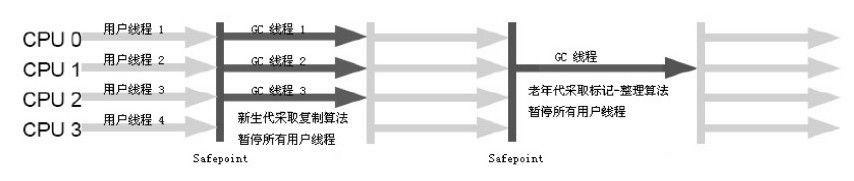
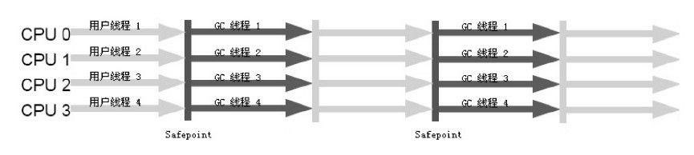

# [7种垃圾收集器](https://crowhawk.github.io/2017/08/15/jvm_3/)

- **如果说收集算法是内存回收的方法论，那么垃圾收集器就是内存回收的具体实现** 。
- Java虚拟机规范中对垃圾收集器应该如何实现并没有任何规定，因此不同的厂商、版本的虚拟机所提供的垃圾收集器都可能会有很大差别，并且一般都会提供参数供用户根据自己的应用特点和要求组合出各个年代所使用的收集器。
- 接下来讨论的收集器基于JDK1.7 Update 14 之后的HotSpot虚拟机，该虚拟机包含的所有收集器如下图所示：

- 上图展示了7种作用于不同分代的收集器，如果两个收集器之间存在连线，就说明它们可以搭配使用。
- 虚拟机所处的区域，则表示它是属于新生代收集器还是老年代收集器。
- Hotspot实现了如此多的收集器，正是因为目前并无完美的收集器出现，只是选择对具体应用最适合的收集器。

---

# 新生代收集器

### Serial收集器

- 这个收集器是一个单线程的收集器，但它的“单线程”的意义不仅说明它只会使用一个 CPU 或一条收集线程去完成垃圾收集工作，更重要的是在它进行垃圾收集时，必须暂停其他所有的工作线程，直到它收集结束。
- 下图展示了Serial 收集器（老年代采用Serial Old收集器）的运行过程：

- 它依然是虚拟机运行在 Client 模式下的默认新生代收集器。
- 优点：简单而高效（与其他收集器的单线程比），对于限定单个 CPU 的环境来说，Serial 收集器由于没有线程交互的开销，专心做垃圾收集自然可以获得最高的单线程收集效率。
- 在用户的桌面应用场景中，分配给虚拟机管理的内存一般来说不会很大，收集几十兆甚至一两百兆的新生代，停顿时间完全可以控制在几十毫秒最多一百多毫秒以内，只要不是频繁发生，这点停顿是可以接受的。所以，Serial 收集器对于运行在 Client 模式下的虚拟机来说是一个很好的选择。

### ParNew 收集器

- ParNew 收集器其实就是 Serial 收集器的多线程版本。
- ParNew收集器的工作过程如下图（老年代采用Serial Old收集器）：

- ParNew 收集器除了多线程收集之外，其他与 Serial 收集器相比并没有太多创新之处，但它却是许多运行在 Server 模式下的虚拟机中首选的新生代收集器。
- 重要原因：除了Serial收集器外，目前只有它能与CMS收集器配合工作。
- ParNew 收集器在单 CPU 的环境中绝对不会有比Serial收集器更好的效果，甚至由于存在线程交互的开销，该收集器在通过超线程技术实现的两个 CPU 的环境中都不能百分之百地保证可以超越 Serial 收集器。
- 随着可以使用的 CPU 的数量的增加，它对于 GC 时系统资源的有效利用还是很有好处的。
- 默认开启的收集线程数与CPU的数量相同，在CPU非常多（譬如32个，现在CPU动辄就4核加超线程，服务器超过32个逻辑CPU的情况越来越多了）的环境下，可以使用 -XX:ParallelGCThreads 参数来限制垃圾收集的线程数。

### Parallel Scavenge 收集器

- **Parallel Scavenge**收集器也是一个**并行**的**多线程新生代**收集器，它也使用**复制算法**。Parallel Scavenge收集器的特点是它的关注点与其他收集器不同，CMS等收集器的关注点是尽可能缩短垃圾收集时用户线程的停顿时间，而Parallel Scavenge收集器的目标是**达到一个可控制的吞吐量（Throughput）**。
- **停顿时间越短就越适合需要与用户交互的程序**，良好的响应速度能提升用户体验。而**高吞吐量**则可以高效率地利用CPU时间，尽快完成程序的运算任务，主要适合**在后台运算而不需要太多交互的任务**。
- Parallel Scavenge收集器除了会显而易见地提供可以精确控制吞吐量的参数，还提供了一个参数**-XX:+UseAdaptiveSizePolicy**，这是一个开关参数，打开参数后，就不需要手工指定新生代的大小（-Xmn）、Eden和Survivor区的比例（-XX:SurvivorRatio）、晋升老年代对象年龄（-XX:PretenureSizeThreshold）等细节参数了，虚拟机会根据当前系统的运行情况收集性能监控信息，动态调整这些参数以提供最合适的停顿时间或者最大的吞吐量，这种方式称为**GC自适应的调节策略（GC Ergonomics）**。自适应调节策略也是Parallel Scavenge收集器与ParNew收集器的一个重要区别。
- 另外值得注意的一点是，Parallel Scavenge收集器无法与CMS收集器配合使用，所以在JDK 1.6推出Parallel Old之前，如果新生代选择Parallel Scavenge收集器，老年代只有Serial Old收集器能与之配合使用。

---

# 老年代收集器

### Serial Old收集器

- Serial Old 是 Serial收集器的老年代版本，它同样是一个**单线程收集器**，使用**“标记-整理”（Mark-Compact）**算法。
- 此收集器的主要意义也是在于给Client模式下的虚拟机使用。如果在Server模式下，它还有两大用途：
  - 在JDK1.5 以及之前版本（Parallel Old诞生以前）中与Parallel Scavenge收集器搭配使用。
  - 作为CMS收集器的后备预案，在并发收集发生**Concurrent Mode Failure**时使用。
- 它的工作流程与Serial收集器相同，这里再次给出Serial/Serial Old配合使用的工作流程图：

### Parallel Old收集器

- Parallel Old收集器是Parallel Scavenge收集器的老年代版本，使用**多线程**和**“标记-整理”**算法。
- 前面已经提到过，这个收集器是在JDK 1.6中才开始提供的，在此之前，如果新生代选择了Parallel Scavenge收集器，老年代除了Serial Old以外别无选择，所以在Parallel Old诞生以后，**“吞吐量优先”收集器**终于有了比较名副其实的应用组合，在**注重吞吐量**以及**CPU资源敏感**的场合，都可以优先考虑Parallel Scavenge加Parallel Old收集器。
- Parallel Old收集器的工作流程与Parallel Scavenge相同，这里给出Parallel Scavenge/Parallel Old收集器配合使用的流程图：

### CMS 收集器

- CMS（`Concurrent Mark Sweep`）收集器是一种以获取最短回收停顿时间为目标的收集器，目前很大一部分的 Java 应用集中在互联网站或者 B/S 系统的服务端上，这类应用尤其重视服务的响应速度，希望系统停顿时间最短，以给用户带来较好的体验。CMS 收集器就非常符合这类应用的需求。
- CMS收集器是基于“标记—清除”算法实现的。
- 运作过程相对于前面几种收集器来说更复杂，分为四个步骤：
  - **初始标记（CMS initial mark）**：仅仅只是标记一下GC Roots能直接关联到的对象，速度很快，需要“Stop The World”。
  - **并发标记（CMS concurrent mark）**：进行**GC Roots Tracing**的过程，在整个过程中耗时最长。
  - **重新标记（CMS remark）**：为了修正并发标记期间因用户程序继续运作而导致标记产生变动的那一部分对象的标记记录，这个阶段的停顿时间一般会比初始标记阶段稍长一些，但远比并发标记的时间短。此阶段也需要“Stop The World”。
  - **并发清除（CMS concurrent sweep）**
- 由于整个过程中耗时最长的并发标记和并发清除过程收集器线程都可以与用户线程一起工作，所以，从总体上来说，CMS收集器的内存回收过程是与用户线程一起并发执行的。通过下图可以比较清楚地看到CMS收集器的运作步骤中并发和需要停顿的时间：

##### 优点

- CMS是一款优秀的收集器，它的主要**优点**在名字上已经体现出来了：**并发收集**、**低停顿**，因此CMS收集器也被称为**并发低停顿收集器（Concurrent Low Pause Collector）**。

##### 缺点

- **CPU资源非常敏感** 其实，面向并发设计的程序都对CPU资源比较敏感。在并发阶段，它虽然不会导致用户线程停顿，但会因为占用了一部分线程（或者说CPU资源）而导致应用程序变慢，总吞吐量会降低。**CMS默认启动的回收线程数是（CPU数量+3）/4**，也就是当CPU在4个以上时，并发回收时垃圾收集线程不少于25%的CPU资源，并且随着CPU数量的增加而下降。但是**当CPU不足4个时（比如2个），CMS对用户程序的影响就可能变得很大** 。
- **无法处理浮动垃圾（Floating Garbage）** 可能出现“Concurrent Mode Failure”失败而导致另一次Full GC的产生。**由于CMS并发清理阶段用户线程还在运行着，伴随程序运行自然就还会有新的垃圾不断产生** 。也是由于在垃圾收集阶段用户线程还需要运行，那也就还需要预留有足够的内存空间给用户线程使用，因此CMS收集器不能像其他收集器那样等到老年代几乎完全被填满了再进行收集，需要预留一部分空间提供并发收集时的程序运作使用。
- **标记-清除算法导致的空间碎片** CMS是一款基于“标记-清除”算法实现的收集器，这意味着收集结束时会有大量空间碎片产生。空间碎片过多时，将会给大对象分配带来很大麻烦，往往出现老年代空间剩余，但无法找到足够大连续空间来分配当前对象。

---

# G1收集器

- 与其他GC收集器相比，G1具备如下特点：
  - **并行与并发** G1 能充分利用多CPU、多核环境下的硬件优势，使用多个CPU来缩短“Stop The World”停顿时间，部分其他收集器原本需要停顿Java线程执行的GC动作，G1收集器仍然可以通过并发的方式让Java程序继续执行。
  - **分代收集** 与其他收集器一样，分代概念在G1中依然得以保留。虽然G1可以不需要其他收集器配合就能独立管理整个GC堆，但它能够采用不同方式去处理新创建的对象和已存活一段时间、熬过多次GC的旧对象来获取更好的收集效果。
  - **空间整合** G1从整体来看是基于**“标记-整理”**算法实现的收集器，从局部（两个Region之间）上来看是基于**“复制”**算法实现的。这意味着G1运行期间不会产生内存空间碎片，收集后能提供规整的可用内存。
  - **可预测的停顿** 这是G1相对CMS的一大优势，降低停顿时间是G1和CMS共同的关注点，但G1除了降低停顿外，还能建立可预测的停顿时间模型，能让使用者明确指定在一个长度为M毫秒的时间片段内，消耗在GC上的时间不得超过N毫秒，这几乎已经是实时Java（RTSJ）的垃圾收集器的特征了。

### 横跨整个堆内存

- 在G1之前的其他收集器进行收集的范围都是整个新生代或者老生代，而G1不再是这样。G1在使用时，Java堆的内存布局与其他收集器有很大区别，它**将整个Java堆划分为多个大小相等的独立区域（Region）**，虽然还保留新生代和老年代的概念，但**新生代和老年代不再是物理隔离的了，而都是一部分Region（不需要连续）的集合**。

### 建立可预测的时间模型

- G1收集器之所以能建立可预测的停顿时间模型，是因为它可以**有计划地避免在整个Java堆中进行全区域的垃圾收集**。G1跟踪各个Region里面的垃圾堆积的价值大小（回收所获得的空间大小以及回收所需时间的经验值），**在后台维护一个优先列表**，每次根据允许的收集时间，**优先回收价值最大的Region（这也就是Garbage-First名称的来由）**。这种使用Region划分内存空间以及有优先级的区域回收方式，保证了G1收集器在有限的时间内可以获取尽可能高的收集效率。

### 避免全堆扫描——Remembered Set

- G1把Java堆分为多个Region，就是“化整为零”。但是Region不可能是孤立的，一个对象分配在某个Region中，可以与整个Java堆任意的对象发生引用关系。在做可达性分析确定对象是否存活的时候，需要扫描整个Java堆才能保证准确性，这显然是对GC效率的极大伤害。
- 为了避免全堆扫描的发生，虚拟机**为G1中每个Region维护了一个与之对应的Remembered Set**。虚拟机发现程序在对Reference类型的数据进行写操作时，会产生一个Write Barrier暂时中断写操作，检查Reference引用的对象是否处于不同的Region之中（在分代的例子中就是检查是否老年代中的对象引用了新生代中的对象），如果是，便通过CardTable**把相关引用信息记录到被引用对象所属的Region的Remembered Set之中**。当进行内存回收时，在GC根节点的枚举范围中加入Remembered Set即可保证不对全堆扫描也不会有遗漏。

### 运行过程

- 如果不计算维护Remembered Set的操作，G1收集器的运作大致可划分为以下几个步骤：
  - **初始标记（Initial Marking）** 仅仅只是标记一下GC Roots 能直接关联到的对象，并且修改**TAMS（Nest Top Mark Start）**的值，让下一阶段用户程序并发运行时，能在正确可以的Region中创建对象，此阶段需要**停顿线程**，但耗时很短。
  - **并发标记（Concurrent Marking）** 从GC Root 开始对堆中对象进行**可达性分析**，找到存活对象，此阶段耗时较长，但**可与用户程序并发执行**。
  - **最终标记（Final Marking）** 为了修正在并发标记期间因用户程序继续运作而导致标记产生变动的那一部分标记记录，虚拟机将这段时间对象变化记录在**线程的Remembered Set Logs**里面，最终标记阶段需要**把Remembered Set Logs的数据合并到Remembered Set中**，这阶段需要**停顿线程**，但是**可并行执行**。
  - **筛选回收（Live Data Counting and Evacuation）** 首先对各个Region中的回收价值和成本进行排序，根据用户所期望的GC 停顿是时间来制定回收计划。此阶段其实也可以做到与用户程序一起并发执行，但是因为只回收一部分Region，时间是用户可控制的，而且停顿用户线程将大幅度提高收集效率。
- 通过下图可以比较清楚地看到G1收集器的运作步骤中并发和需要停顿的阶段（Safepoint处）：

---

# 总结

| 收集器                | 串行、并行or并发 | 新生代/老年代 | 算法               | 目标         | 适用场景                                  |
| --------------------- | ---------------- | ------------- | ------------------ | ------------ | ----------------------------------------- |
| **Serial**            | 串行             | 新生代        | 复制算法           | 响应速度优先 | 单CPU环境下的Client模式                   |
| **Serial Old**        | 串行             | 老年代        | 标记-整理          | 响应速度优先 | 单CPU环境下的Client模式、CMS的后备预案    |
| **ParNew**            | 并行             | 新生代        | 复制算法           | 响应速度优先 | 多CPU环境时在Server模式下与CMS配合        |
| **Parallel Scavenge** | 并行             | 新生代        | 复制算法           | 吞吐量优先   | 在后台运算而不需要太多交互的任务          |
| **Parallel Old**      | 并行             | 老年代        | 标记-整理          | 吞吐量优先   | 在后台运算而不需要太多交互的任务          |
| **CMS**               | 并发             | 老年代        | 标记-清除          | 响应速度优先 | 集中在互联网站或B/S系统服务端上的Java应用 |
| **G1**                | 并发             | both          | 标记-整理+复制算法 | 响应速度优先 | 面向服务端应用，将来替换CMS               |