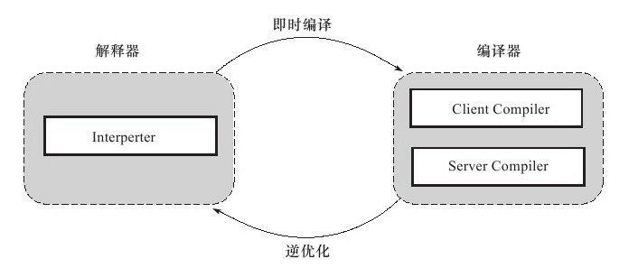
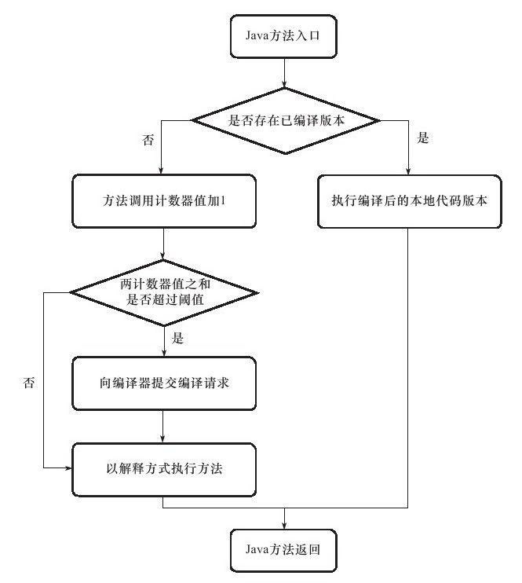
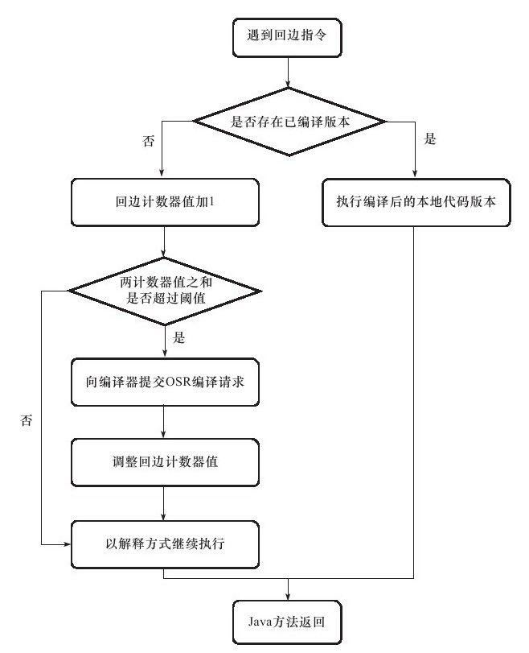

# HotSpot的即时编译器

### 解释器与编译器

- 解释器与编译器两者各有优势：
  - 当程序需要迅速启动和执行的时候，解释器可以首先发挥作用，省去编译的时间，立即执行。
  - 在程序运行后，随着时间的推移，编译器逐渐发挥作用，把越来越多的代码编译成本地代码之后，可以获取更高的执行效率。
- 当程序运行环境中内存资源限制较大（如部分嵌入式系统中），可以使用解释执行节约内存，反之可以使用编译执行来提升效率。
- 同时，解释器还可以作为编译器激进优化时的一个“逃生门”，让编译器根据概率选择一些大多数时候都能提升运行速度的优化手段，当激进优化的假设不成立，如加载了新类后类型继承结构出现变化、出现“罕见陷阱”（*Uncommon Trap*）时可以通过逆优化（*Deoptimization*）退回到解释状态继续执行。
- 在整个虚拟机执行架构中，解释器与编译器经常配合工作，如图所示：

### HotSpot 内置即时编译器

- HotSpot 虚拟机中内置了两个即时编译器，分别称为 Client Compiler 和 Server Compiler，或者简称为 C1 编译器和 C2 编译器（也叫 Opto 编译器）。
- 目前主流的 HotSpot 虚拟机（ Sun 系列 JDK 1.7 及之前版本的虚拟机）中，默认采用解释器与其中一个编译器直接配合的方式工作。

### 编译层次

- 为了在程序启动响应速度与运行效率之间达到最佳平衡，HotSpot 虚拟机还会逐渐启用分层编译（*Tiered Compilation*）的策略，分层编译的概念在 JDK 1.6 时期出现，后来一直处于改进阶段，最终在 JDK 1.7 的 Server 模式虚拟机中作为默认编译策略被开启。
- 分层编译根据编译器编译、优化的规模与耗时，划分出不同的编译层次，其中包括：
  - 第 0 层，程序解释执行，解释器不开启性能监控功能（*Profiling*），可触发第 1 层编译。
  - 第 1 层，也称为 C1 编译，将字节码编译为本地代码，进行简单、可靠的优化，如有必要将加入性能监控的逻辑。
  - 第 2 层（或 2 层以上），也称为 C2 编译，也是将字节码编译为本地代码，但是会启用一些编译耗时较长的优化，甚至会根据性能监控信息进行一些不可靠的激进优化。
- 实施分层编译后，Client Compiler 和 Server Compiler 将会同时工作，许多代码都可能会被多次编译，用 Client Compiler 获取更高的编译速度，用 Server Compiler 来获取更好的编译质量，在解释执行的时候也无须再承担收集性能监控信息的任务。

### 编译对象与触发条件

- 上文中提到过，在运行过程中会被即时编译器编译的“热点代码”有两类，即：
  - 被多次调用的方法。
  - 被多次执行的循环体。
- 前者很好理解，一个方法被调用得多了，方法体内代码执行的次数自然就多，它成为“热点代码”是理所当然的。
- 而后者则是为了解决一个方法只被调用过一次或少量的几次，但是方法体内部存在循环次数较多的循环体的问题，这样循环体的代码也被重复执行多次，因此这些代码也应该认为是“热点代码”。

##### 被多次调用的方法

- 对于第一种情况，由于是由方法调用触发的编译，因此编译器理所当然地会以整个方法作为编译对象，这种编译也是虚拟机中标准的 JIT 编译方式。
- 而对于后一种情况，尽管编译动作是由循环体所触发的，但编译器依然会以整个方法（而不是单独的循环体）作为编译对象。
- 这种编译方式因为编译发生在方法执行过程之中，因此形象地称之为栈上替换（*On Stack Replacement*，简称为 OSR 编译，即方法栈帧还在栈上，方法就被替换了）。

##### 判断是否热点代码

- 断一段代码是不是热点代码，是不是需要触发即时编译，这样的行为称为热点探测（*Hot Spot Detection*），其实进行热点探测并不一定要知道方法具体被调用了多少次，目前主要的热点探测判定方式有两种，分别如下。
- 基于采样的热点探测（*Sample Based Hot Spot Detection*）：
  - 采用这种方法的虚拟机会周期性地检查各个线程的栈顶，如果发现某个（或某些）方法经常出现在栈顶，那这个方法就是“热点方法”。
  - 基于采样的热点探测的好处是实现简单、高效，还可以很容易地获取方法调用关系（将调用堆栈展开即可），缺点是很难精确地确认一个方法的热度，容易因为受到线程阻塞或别的外界因素的影响而扰乱热点探测。
- 基于计数器的热点探测（Counter Based Hot Spot Detection）：
  - 采用这种方法的虚拟机会为每个方法（甚至是代码块）建立计数器，统计方法的执行次数，如果执行次数超过一定的阈值就认为它是“热点方法”。
  - 这种统计方法实现起来麻烦一些，需要为每个方法建立并维护计数器，而且不能直接获取到方法的调用关系，但是它的统计结果相对来说更加精确和严谨。

### HotSpot 基于计数器的热点探测方法

-  HotSpot 虚拟机中使用的是第二种——基于计数器的热点探测方法，因此它为每个方法准备了两类计数器：方法调用计数器（*Invocation Counter*）和回边计数器（*Back Edge Counter*）。
- 在确定虚拟机运行参数的前提下，这两个计数器都有一个确定的阈值，当计数器超过阈值溢出了，就会触发 JIT 编译。

##### 方法调用计数器

- 顾名思义，这个计数器就用于统计方法被调用的次数，它的默认阈值在 Client 模式下是 1500 次，在 Server 模式下是 10000 次，这个阈值可以通过虚拟机参数 -XX:CompileThreshold 来人为设定。
- 当一个方法被调用时，会先检查该方法是否存在被 JIT 编译过的版本，如果存在，则优先使用编译后的本地代码来执行。
- 如果不存在已被编译过的版本，则将此方法的调用计数器值加 1，然后判断方法调用计数器与回边计数器值之和是否超过方法调用计数器的阈值。
- 如果已超过阈值，那么将会向即时编译器提交一个该方法的代码编译请求。

- 如果不做任何设置，执行引擎并不会同步等待编译请求完成，而是继续进入解释器按照解释方式执行字节码，直到提交的请求被编译器编译完成。

- 当编译工作完成之后，这个方法的调用入口地址就会被系统自动改写成新的，下一次调用该方法时就会使用已编译的版本。

- 整个 JIT 编译的交互过程如图所示：

  

- 如果不做任何设置，方法调用计数器统计的并不是方法被调用的绝对次数，而是一个相对的执行频率，即一段时间之内方法被调用的次数。

- 当超过一定的时间限度，如果方法的调用次数仍然不足以让它提交给即时编译器编译，那这个方法的调用计数器就会被减少一半，这个过程称为方法调用计数器热度的衰减（*Counter Decay*），而这段时间就称为此方法统计的半衰周期（*Counter Half Life Time*）。

- 进行热度衰减的动作是在虚拟机进行垃圾收集时顺便进行的，可以使用虚拟机参数 -XX:-UseCounterDecay 来关闭热度衰减，让方法计数器统计方法调用的绝对次数，这样，只要系统运行时间足够长，绝大部分方法都会被编译成本地代码。

- 另外，可以使用-XX：CounterHalfLifeTime参数设置半衰周期的时间，单位是秒。

##### 回边计数器

- 回边计数器，它的作用是统计一个方法中循环体代码执行的次数，在字节码中遇到控制流向后跳转的指令称为“回边”（*Back Edge*）。

- 显然，建立回边计数器统计的目的就是为了触发 OSR 编译。

- 关于回边计数器的阈值，虽然 HotSpot 虚拟机也提供了一个类似于方法调用计数器阈值 -XX:CompileThreshold 的参数 -XX:BackEdgeThreshold 供用户设置，但是当前的虚拟机实际上并未使用此参数，因此我们需要设置另外一个参数 -XX:OnStackReplacePercentage 来间接调整回边计数器的阈值，其计算公式如下：

  - 虚拟机运行在Client模式下，回边计数器阈值计算公式为：
    - 方法调用计数器阈值（*CompileThreshold*）× OSR 比率（*OnStackReplacePercentage*）/ 100。
    -  其中 OnStackReplacePercentage 默认值为 933，如果都取默认值，那 Client 模式虚拟机的回边计数器的阈值为 13995。
  - 虚拟机运行在Server模式下，回边计数器阈值的计算公式为：
    - 方法调用计数器阈值（*CompileThreshold*）×（OSR 比率（*OnStackReplacePercentage*）- 解释器监控比率（*InterpreterProfilePercentage*）/ 100。
    - 其中 OnStackReplacePercentage 默认值为 140，InterpreterProfilePercentage 默认值为 33，如果都取默认值，那 Server 模式虚拟机回边计数器的阈值为 10700。

- 当解释器遇到一条回边指令时，会先查找将要执行的代码片段是否有已经编译好的版本。

- 如果有，它将会优先执行已编译的代码，否则就把回边计数器的值加 1，然后判断方法调用计数器与回边计数器值之和是否超过回边计数器的阈值。

- 当超过阈值的时候，将会提交一个 OSR 编译请求，并且把回边计数器的值降低一些，以便继续在解释器中执行循环，等待编译器输出编译结果，整个执行过程如图所示：

  

- 与方法计数器不同，回边计数器没有计数热度衰减的过程，因此这个计数器统计的就是该方法循环执行的绝对次数。

- 当计数器溢出的时候，它还会把方法计数器的值也调整到溢出状态，这样下次再进入该方法的时候就会执行标准编译过程。

##### 注

- 上面的方法调用计数器和回边计数器的执行过程图都仅仅述了 Client VM 的即时编译方式，对于 Server VM 来说，执行情况会比上面的描述更复杂一些。