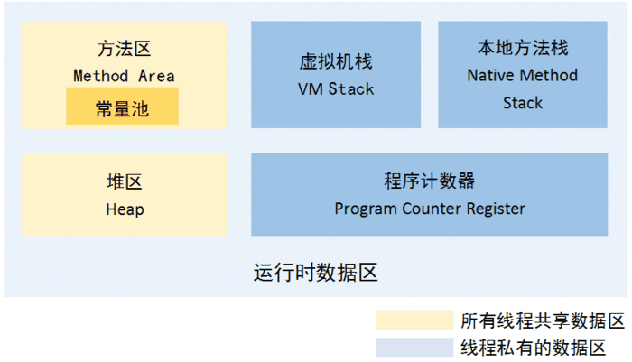
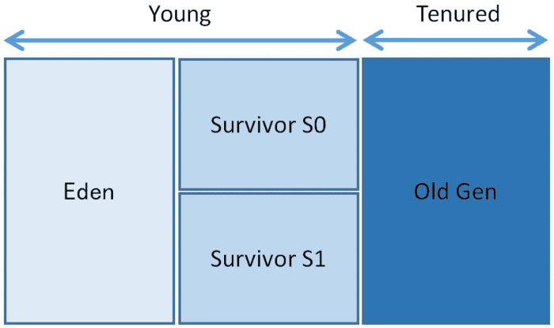
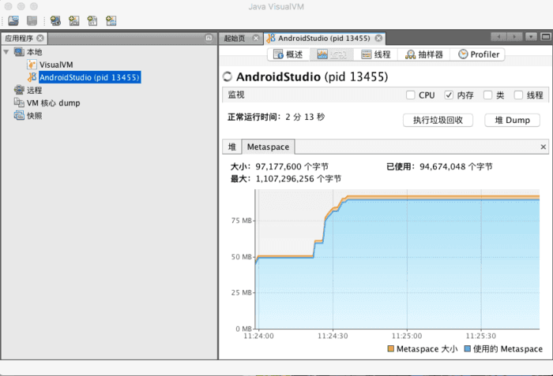

# [JVM内存模型](https://www.jianshu.com/p/1579aafac60b)

### 意义

- 虽然Java虚拟机自动内存管理为Java开发者节省很多开发时间，不需要再为内存管理编写冗余易错的代码。要是对JVM的内存模型和内存回收机制不熟悉，还是会在不经意间造成内存泄漏。
- 这是我们必须了解JVM内存模型的理由：
  - 在有限的内存中完成更多工作。
  - 编写代码时避免出现内存泄漏或内存溢出。
  - 编写性能更优的代码。
  - Java内存调优。

### 分类及简单介绍

- 运行时内存数据区大体上被分为5个区域、两种类型。
- 5个数据区包括：`方法区`、`堆区`、`虚拟机栈`、`本地方法栈`、`程序计数器` 。

##### 两种类型

1. 所有线程共享的数据区：
   1. **方法区**: 存储已被虚拟机加载的类信息、常量、静态变量、即时编译后代码等数据。常量池位于方法区，并使用永久代来实现方法区。
   2. **堆区**: 我们常说用于存放对象的区域。
2. 线程私有(隔离)数据区：
   1. **虚拟机栈**: 方法执行时创建一个栈帧，用于存储局部变量、操作数栈、动态链接、方法出口等信息。每个方法一个栈帧，互不干扰。
   2. **本地方法栈**: 用于存放执行native方法的运行数据。
   3. **程序计数器**: 当前线程所执行的字节码的指示器，通过改变计数器来选取下一条需要执行的字节码指令。

# 模型具体介绍

### 程序计数器

- 程序计数器可看做当前线程所执行字节码行号的指示器。每个线程都有一个独立的程序计数器，各个线程之间计数器互不影响，独立存储。
- 如果当前线程执行的是Native方法，则这个计数器为空。执行Java方法时，这个计数器记录执行字节码指令地址。

### 虚拟机栈

- 虚拟机栈是线程私有的，生命周期和线程的相同。方法在执行的时候，都会有一个栈帧创建出来，用于存储局部变量表、操作数栈、动态链接、方法出口等信息，而这个栈帧就存放在虚拟机栈中。
- 进入方法前先会创建栈帧入栈作为栈顶栈帧，然后使用这个栈帧。
- 同样，方法执行完后栈帧出栈并销毁，继续执行栈中的栈顶栈帧。

### 本地方法栈

- 虚拟机执行Native方法时使用，不同的虚拟机有不同的实现方法，HotSpot虚拟机的本地方法栈和虚拟机栈合二为一。

### Java堆区

- 堆区是开发过程中接触最多的JVM内存区域，也是我们相对关注的。该区域被所有线程共享，所有创建的对象都在这个区域分配内存并初始化。
- 堆区中内存分配和回收要消耗非常多的性能和时间。相比之下，栈更容易管理且轻巧。
- 有些在堆区保存的对象，通过一定的技术手段，自动转变为在栈中完成生命周期，这种技术就是逃逸分析。把本来存放在堆内存的数据分配到栈中。这样，数据的生命周期就能随着入栈和出栈而完成管理，不需要像堆内存一样进行内存繁杂的回收操作，减轻堆内存的压力。

- 堆区分代回收是为了区分不同对象的生命周期，并做出合理分配和回收操作。
- 从分配的角度来看，线程本地缓冲区(Thread local allocation buffer, TLAB)有利于更高效地划分线程私有的缓冲区。
- 大部分对象生命很短，基本熬不过第一次经历的垃圾收集。
- 新创建的对象首先存放在Eden区。经过垃圾回收且存活的对象会进入两个Survivor中的一个。此时，这个Survivor区就称为To Survivor。
- 而另一个区称为From Survivor。From Survivor会把本次回收存活的对象移到To Survivor，然后清空区域内所有对象。

- From Survivor和To Survivor名字是相对的。对象移出的区就称为From Survivor，对象进入的区域称为To Survivor。大多数时间两个区有一个是占用的，另一个已经清空的。
- 这样，在Survivor的对象会在两个区中来回经历GC，达到一定年龄后会被移到老年代。因为这个对象多次垃圾回收依然存活，表明这个对象比较稳定，此后在老年代经历垃圾回收的频率非常低。
- 如果一个新的对象太大，以至于新生代经过一次垃圾回收后依然没有足够空间存放它。JVM会通过分配担保来把这个对象放在老年代。如果老年代空间不够，经过一次Full GC还是没有空间，那虚拟机无法为这个对象创建内存空间，只能抛出OOM异常停止运行。

### 方法区

- 用于存放虚拟机加载的信息、常量、静态变量、即时编译器编译后的代码等数据。
- 由于永久代存储的数据生命周期非常长，GC在这个区域消耗时间长且回收效果差，所以方法区GC频率很低。
- 不同回收策略对方法区的处理：
  - G1：只有在Full GC的时候方法区才会被清理。当方法区需要空间时，该空间无法扩展又没有内存空间可以回收，就会抛出OutOfMemory异常。
  - CMS：可以使用 -XX:+CMSClassUnloadingEnabled 参数，在CMS并行收集阶段回收PermGen空间。

### 方法区中的常量池

- 又称运行时常量池，是方法区的一部分。用于存放编译器生成的各种字面量和符号引用。除外，运行期间新的常量也会放入常量池中。常见运行时常量池添加是通过String类的intern()方法。

1. 字面量：如文本字符串、final的常量值。
2. 符号引用：编译语言层面的概念，包括以下3类：
   - 类和接口的全限定名
   - 字段的名称和描述符
   - 方法的名称和描述符
3. 因为这部分是方法区的一个部分，所以使用空间受到方法区的影响。

### 直接内存

- 直接内存不是虚拟机运行时内存的一部分，该空间划分在虚拟机外。不过由于直接内存的性能比较好，所以有的工作需要使用直接内存来提高性能。
- 直接内存会受到物理机剩余可用内存、处理器寻址空间的限制。可以通过NIO和NIO.2来申请直接内存。如果虚拟机堆内存分配太大，可能会导致直接内存空间不足而出现运行时异常。

# 最新变化

### 元数据区 Metaspace

- 由于PermGen内存管理的效果远没有达到预期，所以JCP已经着手去除PermGen的工作。在JDK7中，字符串常量已经从永久代移除。
- 现今JDK8中PermGen已经被彻底移除，取而代之的是metaspace数据区，使用native内存，申请和释放由虚拟机负责管理。
- 在JDK8下，旧的参数-XX:PermSize和-XX:MaxPermSize会被忽略并显示警告。新的Metaspace通过参数-XX:MetaspaceSize 和-XX:MaxMetaspaceSize设定。
- 下图是在JDK8u102中开启Android Studio后，在jvisualvm中只看见Metaspace而没有PermGen，这表明JDK8中没有PermGen，已经被彻底移除。取而代之的是Metaspace。

### G1内存模型

- 从JDK7开始引入的G1回收机制，到JDK8时G1已经基本稳定。
- G1应该是唯一一个能完成新生代到老年代所有管理的GC技术。之前的技术如上一节图中CMS和PerNew需要互相配合才能完成完整回收工作。
- 基于G1回收的特殊性，G1的内存模型和上面介绍的内存模型是有差别的。也就是说，上面的内存模型对G1是无效的。
- 由于现在还没有太多的资料可以参考G1的内存模型。如果有需要深入了解，请阅读OpenJDK中HotSpot JVM关于G1的源码。
- 如果没有特殊要求，现时CMS和PerNew已经很好适应大部分应用场景。毕竟CMS用了多年，出现问题也容易找到解决方法。