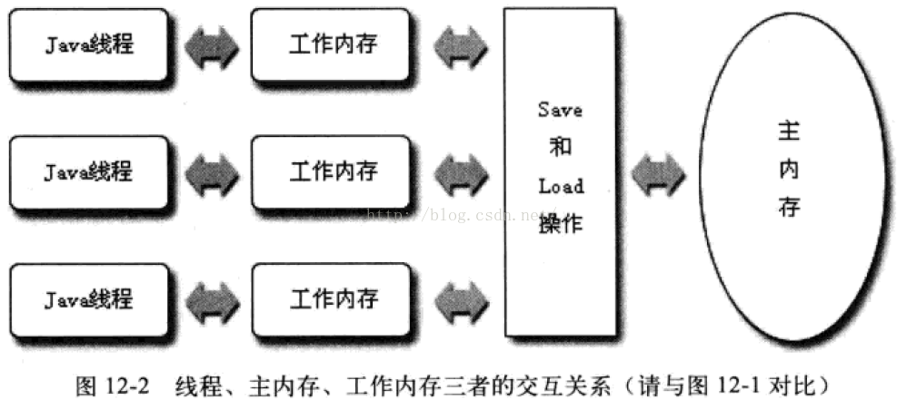

# [Java内存模型](http://www.cnblogs.com/chihirotan/p/6486436.html)

- Java 内存模型来屏蔽掉各种硬件和操作系统的内存差异，达到跨平台的内存访问效果。JLS(Java语言规范)定义了一个统一的内存管理模型*JMM*(Java Memory Model)。
- Java内存模型规定了所有的变量都存储在主内存中，此处的主内存仅仅是虚拟机内存的一部分，而虚拟机内存也仅仅是计算机物理内存的一部分（为虚拟机进程分配的那一部分）。
- Java内存模型分为主内存，和工作内存。主内存是所有的线程所共享的，工作内存是每个线程自己有一个，不是共享的。
- 每条线程还有自己的工作内存，线程的工作内存中保存了被该线程使用到的变量的主内存副本拷贝。线程对变量的所有操作（读取、赋值），都必须在工作内存中进行，而不能直接读写主内存中的变量。不同线程之间也无法直接访问对方工作内存中的变量，线程间变量值的传递均需要通过主内存来完成，线程、主内存、工作内存三者之间的交互关系如下图：

### Java内存间交互操作

- JLS定义了线程对主存的操作指令：lock，unlock，read，load，use，assign，store，write。这些行为是不可分解的原子操作，在使用上相互依赖，read-load从主内存复制变量到当前工作内存，use-assign执行代码改变共享变量值，store-write用工作内存数据刷新主存相关内容。
  - read（读取）：作用于主内存变量，把一个变量值从主内存传输到线程的工作内存中，以便随后的load动作使用
  - load（载入）：作用于工作内存的变量，它把read操作从主内存中得到的变量值放入工作内存的变量副本中。
  - use（使用）：作用于工作内存的变量，把工作内存中的一个变量值传递给执行引擎，每当虚拟机遇到一个需要使用变量的值的字节码指令时将会执行这个操作。
  - assign（赋值）：作用于工作内存的变量，它把一个从执行引擎接收到的值赋值给工作内存的变量，每当虚拟机遇到一个给变量赋值的字节码指令时执行这个操作。
  - store（存储）：作用于工作内存的变量，把工作内存中的一个变量的值传送到主内存中，以便随后的write的操作。
  - write（写入）：作用于主内存的变量，它把store操作从工作内存中一个变量的值传送到主内存的变量中。

### 内存模型的特性

##### 原子性

- 原子性是指一个原子操作在cpu中不可以暂停然后再调度，既不被中断操作，要不执行完成，要不就不执行。原子操作保证了原子性问题。
- x++（包含三个原子操作）
  1. 将变量x 值取出放在寄存器中。
  2. 将将寄存器中的值+1。
  3. 将寄存器中的值赋值给x。
- 由Java内存模型来直接保证的原子性变量操作包括read、load、use、assign、store和write六个，大致可以认为基础数据类型的访问和读写是具备原子性的。
- 如果应用场景需要一个更大范围的原子性保证，Java内存模型还提供了lock和unlock操作来满足这种需求，尽管虚拟机未把lock与unlock操作直接开放给用户使用，但是却提供了更高层次的字节码指令monitorenter和monitorexit来隐匿地使用这两个操作，这两个字节码指令反映到Java代码中就是同步块---synchronized关键字，因此在synchronized块之间的操作也具备原子性。

##### 可见性

- java 内存模型的主内存和工作内存，解决了可见性问题。
- volatile赋予了变量可见——禁止编译器对成员变量进行优化，它修饰的成员变量在每次被线程访问时，都强迫从内存中重读该成员变量的值；而且，当成员变量发生变化时，强迫线程将变化值回写到共享内存，这样在任何时刻两个不同线程总是看到某一成员变量的同一个值，这就是保证了可见性。
- 可见性就是指当一个线程修改了线程共享变量的值，其它线程能够立即得知这个修改。无论是普通变量还是volatile变量都是如此，普通变量与volatile变量的区别是volatile的特殊规则保证了新值能立即同步到主内存，以及每使用前立即从内存刷新。因为我们可以说volatile保证了线程操作时变量的可见性，而普通变量则不能保证这一点。

##### 有序性

- Java内存模型中的程序天然有序性可以总结为一句话：如果在本线程内观察，所有操作都是有序的；如果在一个线程中观察另一个线程，所有操作都是无序的。前半句是指“线程内表现为串行语义”，后半句是指“指令重排序”现象和“工作内存主主内存同步延迟”现象。 