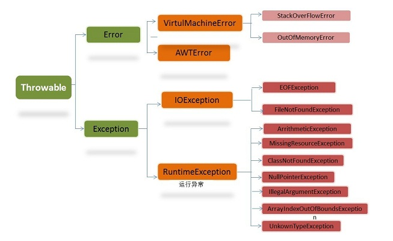

# [Java异常](https://www.jianshu.com/p/325028ea00cd)

### 什么是Java异常

- 异常是一个事件，它发生在程序运行期间，干扰了正常的指令流程。Java通 过API中Throwable类的众多子类描述各种不同的异常。
- 因而，Java异常都是对象，是Throwable子类的实例，描述了出现在一段编码中的错误条件。当条件生成时，错误将引发异常。

- Throwable：Throwable 指定代码中可用异常传播机制通过Java 应用程序传输的任何问题的共性。有两个重要的子类：Exception（异常）和Error（错误），二者都是 Java 异常处理的重要子类，各自都包含大量子类。

  1. Error：程序无法处理的错误，表示运行程序中较严重问题。大多数错误与Coder无关，而表示代码运行时JVM出现的问题。
  2. Exception：程序本身可以处理的异常。
     - 运行时异常：RuntimeException类及其子类异常，如NullPointerException、IndexOutBoundsException等，这些异常是不检查异常，可以选择捕获处理，也可以不捕获。
       - 运行时异常的特点是Java编译器不会检查它，也就是说，当程序中可能出现这类异常，即使没有用try-catch语句捕获它，也没有用throws子句声明抛出它，也会编译通过。
     - 非运行时异常：是RuntimeException以外的异常，类型上都属于Exception类及其子类。从程序语法角度讲是必须进行处理的异常，如果不处理，程序就不能编译通过。如IOException、SQLException等以及用户自定义的Exception异常，一般情况下不自定义检查异常。

  - 区别：异常能被程序本身处理，错误是无法处理。

### 处理异常机制

- 抛出异常：
  - 当一个方法出现错误引发异常时，方法创建异常对象并交付运行时系统，异常对象中包含了异常类型和异常出现时的程序状态等异常信息。运行时系统负责寻找处置异常的代码并执行。
- 捕获异常：
  - 在方法抛出异常之后，运行时系统将转为寻找合适的异常处理器（exception handler）。
  - 潜在的异常处理器是异常发生时依次存留在调用栈中的方法的集合。
  - 当异常处理器所能处理的异常类型与方法抛出的异常类型相符时，即为合适的异常处理器。
  - 运行时系统从发生异常的方法开始，依次回查调用栈中的方法，直至找到含有合适异常处理器的方法并执行。
  - 当运行时系统遍历调用栈而未找到合适的异常处理器，则运行时系统终止。
  - 同时，意味着Java程序的终止。
- 总体来说：
  - Java规定，对于可查异常必须捕获、或者声明抛出。允许忽略不可查的RuntimeException和Error。

### 捕获异常

1. try-catch语句
   - 关键词try后的一对大括号将一块可能发生异常的代码包起来，称为监控区域。Java方法在运行过程中出现异常，则创建异常对象。将异常抛出监控区域之外，由Java运行时系统试图寻找匹配的catch子句以捕获异常。若有匹配的catch子句，则运行其异常处理代码，try-catch语句结束。
   - 匹配的原则是：如果抛出的异常对象属于catch子句的异常类，或者属于该异常类的子类，则认为生成的异常对象与catch块捕获的异常类型相匹配。
   - 需要注意的是，一旦某个catch捕获到匹配的异常类型，将进入异常处理代码，就意味着整个try-catch语句结束。其他的catch子句不再有匹配和捕获异常类型的机会。
2. try-catch-finally语句
   - finally子句表示无论是否出现异常，都应当执行的内容。

### 抛出异常

1. throws抛出异常
   - 如果一个方法可能会出现异常，但没有能力处理这种异常，可以在方法声明处用throws子句来声明抛出异常。   
   - **Throws抛出异常的规则：**
     1. 如果是不可查异常（unchecked exception），即Error、RuntimeException或它们的子类，那么可以不使用throws关键字来声明要抛出的异常，编译仍能顺利通过，但在运行时会被系统抛出。
     2. 必须声明方法可抛出的任何可查异常（checked exception）。即如果一个方法可能出现受可查异常，要么用try-catch语句捕获，要么用throws子句声明将它抛出，否则会导致编译错误。
     3. 仅当抛出了异常，该方法的调用者才必须处理或者重新抛出该异常。当方法的调用者无力处理该异常的时候，应该继续抛出，而不是囫囵吞枣。
     4. 调用方法必须遵循任何可查异常的处理和声明规则。若覆盖一个方法，则不能声明与覆盖方法不同的异常。声明的任何异常必须是被覆盖方法所声明异常的同类或子类。
2. throw抛出异常
   - throw总是出现在函数体中，用来抛出一个Throwable类型的异常。程序会在throw语句后立即终止，它后面的语句执行不到，然后在包含它的所有try块中（可能在上层调用函数中）从里向外寻找含有与其匹配的catch子句的try块。

### Throwable类中的常用方法：

- getCause()：返回抛出异常的原因。如果cause不存在或未知，则返回null。
- getMessage()：返回异常的消息信息。
- printStackTrace()：对象的堆栈跟踪输出至错误输出流，作为字段System.err的值。

### Java常见异常

- 在Java中提供了一些异常用来描述经常发生的错误，对于这些异常，有的需要程序员进行捕获处理或声明抛出，有的是由Java虚拟机自动进行捕获处理。Java中常见的异常类：
  1. runtimeException子类：
     1. java.lang.ArrayIndexOutOfBoundsException：数组索引越界异常。当 对数组的索引值为负数或大于等于数组大小时抛出。
     2. java.lang.ArithmeticException：算术条件异常。譬如：整数除零等。
     3. java.lang.NullPointerException：空指针异常。当应用试图在要求使用对象的地方使用了null时，抛出该异常。譬如：调用null对象的实例方法、访问null对象的属性、计算null对象的长度、使用throw语句抛出null等等。
     4. java.lang.ClassNotFoundException：找不到类异常。当应用试图根据字符串形式的类名构造类，而在遍历CLASSPAH之后找不到对应名称的class文件时，抛出该异常。
     5. java.lang.NegativeArraySizeException：数组长度为负异常。
     6. java.lang.ArrayStoreException：数组中包含不兼容的值抛出的异常。
     7. java.lang.SecurityException：安全性异常。
     8. java.lang.IllegalArgumentException：非法参数异常。
  2. IOException
     - IOException：操作输入流和输出流时可能出现的异常。
     - EOFException：文件已结束异常。
     - FileNotFoundException：文件未找到异常。
  3. 其他
     - ClassCastException：类型转换异常类。
     - ArrayStoreException：数组中包含不兼容的值抛出的异常。
     - SQLException：操作数据库异常类。
     - NoSuchFieldException：字段未找到异常。
     - NoSuchMethodException：方法未找到抛出的异常。
     - NumberFormatException：字符串转换为数字抛出的异常。
     - StringIndexOutOfBoundsException：字符串索引超出范围抛出的异常。
     - IllegalAccessException：不允许访问某类异常。
     - InstantiationException：当应用程序试图使用Class类中的newInstance()方法创建一个类的实例，而指定的类对象无法被实例化时，抛出该异常。