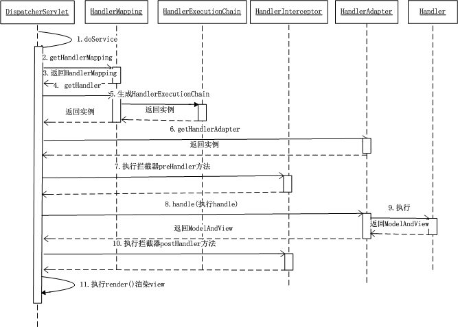

# [Spring MVC工作流程](http://blog.csdn.net/zuoluoboy/article/details/19766131/)

- **Spring工作流程描述** ：
  1. 用户向服务器发送请求，请求被传给Spring的前端控制DispatcherServlet处理。
  2. DispatcherServlet对请求URL进行解析，得到请求资源标识符（URI）。然后根据该URI，调用HandlerMapping获得该Handler配置的所有相关的对象（包括Handler对象以及Handler对象对应的拦截器），最后以HandlerExecutionChain对象的形式返回；
  3. DispatcherServlet 根据获得的Handler，选择一个合适的HandlerAdapter。（**附注**：如果成功获得HandlerAdapter后，此时将开始执行拦截器的preHandler(...)方法）
  4. 提取Request中的模型数据，填充Handler入参，开始执行Handler（Controller）。 在填充Handler的入参过程中，根据你的配置，Spring将帮你做一些额外的工作：
     - HttpMessageConveter： 将请求消息（如Json、xml等数据）转换成一个对象，将对象转换为指定的响应信息。
     - 数据转换：对请求消息进行数据转换。如String转换成Integer、Double等。
     - 数据根式化：对请求消息进行数据格式化。 如将字符串转换成格式化数字或格式化日期等。
     - 数据验证： 验证数据的有效性（长度、格式等），验证结果存储到BindingResult或Error中。
  5. Handler执行完成后，向DispatcherServlet返回一个ModelAndView对象。
  6. 根据返回的ModelAndView，选择一个适合的ViewResolver（必须是已经注册到Spring容器中的ViewResolver)返回给DispatcherServlet 。
  7. ViewResolver结合Model和View，来渲染视图。
  8. 将渲染结果返回给客户端。
- 为什么Spring只使用一个Servlet(DispatcherServlet)来处理所有请求？
  - 详细见J2EE设计模式-前端控制模式。
- Spring为什么要结合使用HandlerMapping以及HandlerAdapter来处理Handler？
  - 符合面向对象中的单一职责原则，代码架构清晰，便于维护，最重要的是代码可复用性高。如HandlerAdapter可能会被用于处理多种Handler。

