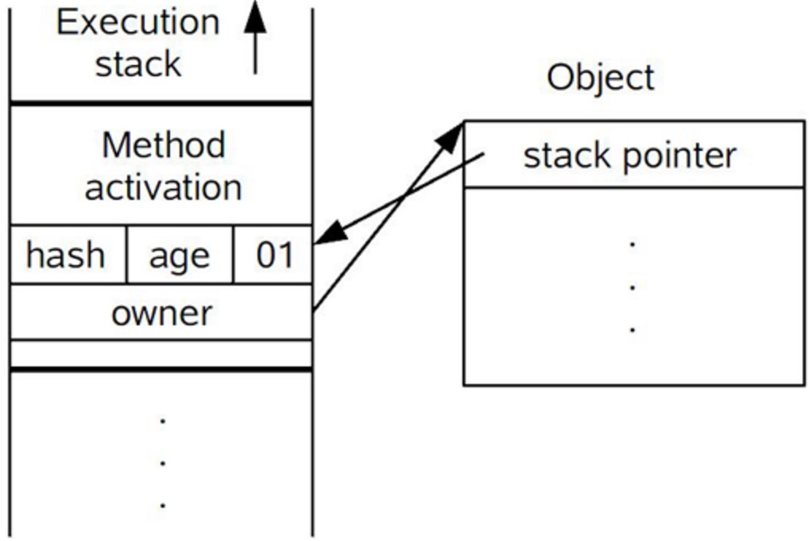
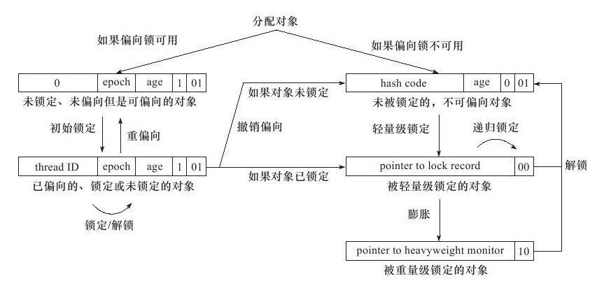

# [Synchronized底层优化](http://www.cnblogs.com/paddix/p/5405678.html)

- Synchronized在 JDK6 之后对其进行了优化，锁总共有四种状态：无锁状态、偏向锁、轻量级锁和重量级锁。
- 随着锁的竞争，锁可以从偏向锁升级到轻量级锁，再升级的重量级锁。（但是锁的升级是单向的，也就是说只能从低到高升级，不会出现锁的降级）

### 重量级锁

- 而操作系统实现线程之间的切换这就需要从用户态转换到核心态，这个成本非常高，状态之间的转换需要相对比较长的时间，这就是为什么Synchronized效率低的原因。
- 因此，这种依赖于操作系统Mutex Lock所实现的锁我们称之为“重量级锁”。
- JDK1.6以后，为了减少获得锁和释放锁所带来的性能消耗，提高性能，引入了“轻量级锁”和“偏向锁”。

### 轻量级锁

- 轻量级锁是 JDK 1.6 之中加入的新型锁机制，它名字中的“轻量级”是相对于使用操作系统互斥量来实现的传统锁而言的，因此传统的锁机制就称为“重量级”锁。
- 首先需要强调一点的是，轻量级锁并不是用来代替重量级锁的，它的本意是在没有多线程竞争的前提下，减少传统的重量级锁使用操作系统互斥量产生的性能消耗。

##### 轻量级锁的加锁过程

1. 在代码进入同步块的时候，如果同步对象锁状态为无锁状态（锁标志位为“01”状态，是否为偏向锁为“0”），虚拟机首先将在当前线程的栈帧中建立一个名为锁记录（Lock Record）的空间，用于存储锁对象目前的Mark Word的拷贝。

2. 拷贝对象头中的Mark Word复制到锁记录中。

3. 拷贝成功后，虚拟机将使用CAS操作尝试将对象的Mark Word更新为指向Lock Record的指针，并将Lock record里的owner指针指向object mark word。如果更新成功，则执行步骤（4），否则执行步骤（5）。

4. 如果这个更新动作成功了，那么这个线程就拥有了该对象的锁，并且对象Mark Word的锁标志位设置为“00”，即表示此对象处于轻量级锁定状态。

   

5. 如果这个更新操作失败了，虚拟机首先会检查对象的Mark Word是否指向当前线程的栈帧，如果是就说明当前线程已经拥有了这个对象的锁，那就可以直接进入同步块继续执行。否则说明多个线程竞争锁，轻量级锁就要膨胀为重量级锁，锁标志的状态值变为“10”，Mark Word中存储的就是指向重量级锁（互斥量）的指针，后面等待锁的线程也要进入阻塞状态。而当前线程便尝试使用自旋来获取锁，自旋就是为了不让线程阻塞，而采用循环去获取锁的过程。

   

##### 轻量级锁的解锁过程

1. 通过CAS操作尝试把线程中复制的Displaced Mark Word对象替换当前的Mark Word。
2. 如果替换成功，整个同步过程就完成了。
3. 如果替换失败，说明有其他线程尝试过获取该锁（此时锁已膨胀），那就要在释放锁的同时，唤醒被挂起的线程。

### 偏向锁

- 偏向锁也是 JDK 1.6 中引入的一项锁优化，它的目的是消除数据在无竞争情况下的同步原语，进一步提高程序的运行性能。
- 这个锁会偏向于第一个获得它的线程，如果在接下来的执行过程中，该锁没有被其他的线程获取，则持有偏向锁的线程将永远不需要再进行同步。
- 当有另外一个线程去尝试获取这个锁时，偏向模式就宣告结束。

##### 偏向锁获取过程

1. 访问Mark Word中偏向锁的标识是否设置成1，锁标志位是否为01——确认为可偏向状态。
2. 如果为可偏向状态，则测试线程ID是否指向当前线程，如果是，进入步骤（5），否则进入步骤（3）。
3. 如果线程ID并未指向当前线程，则通过CAS操作竞争锁。如果竞争成功，则将Mark Word中线程ID设置为当前线程ID，然后执行（5）；如果竞争失败，执行（4）。
4. 如果CAS获取偏向锁失败，则表示有竞争。当到达全局安全点（safepoint）时获得偏向锁的线程被挂起，偏向锁升级为轻量级锁，然后被阻塞在安全点的线程继续往下执行同步代码。
5. 执行同步代码。

##### 偏向锁的释放

- 偏向锁的撤销在上述第四步骤中有提到**。**偏向锁只有遇到其他线程尝试竞争偏向锁时，持有偏向锁的线程才会释放锁，线程不会主动去释放偏向锁。
- 偏向锁的撤销，需要等待全局安全点（在这个时间点上没有字节码正在执行），它会首先暂停拥有偏向锁的线程，判断锁对象是否处于被锁定状态，撤销偏向锁后恢复到未锁定（标志位为“01”）或轻量级锁（标志位为“00”）的状态。

### 重量级锁、轻量级锁和偏向锁之间转换

---

## 其他优化

### 自旋锁与自适应自旋

##### 自旋锁

- 自旋锁在 JDK 1.4.2 中就已经引入，只不过默认是关闭的，可以使用 -XX:+UseSpinning 参数来开启，在 JDK 1.6 中就已经改为默认开启了。
- 自旋等待不能代替阻塞，且先不说对处理器数量的要求，自旋等待本身虽然避免了线程切换的开销，但它是要占用处理器时间的。
- 因此，如果锁被占用的时间很短，自旋等待的效果就会非常好，反之，如果锁被占用的时间很长，那么自旋的线程只会白白消耗处理器资源，而不会做任何有用的工作，反而会带来性能上的浪费。
- 因此，自旋等待的时间必须要有一定的限度，如果自旋超过了限定的次数仍然没有成功获得锁，就应当使用传统的方式去挂起线程了。
- 自旋次数的默认值是 10 次，用户可以使用参数 -XX:PreBlockSpin 来更改。

##### 自适应的自旋锁

- 在 JDK 1.6 中引入了自适应的自旋锁。
- 自适应意味着自旋的时间不再固定了，而是由前一次在同一个锁上的自旋时间及锁的拥有者的状态来决定。
- 如果在同一个锁对象上，自旋等待刚刚成功获得过锁，并且持有锁的线程正在运行中，那么虚拟机就会认为这次自旋也很有可能再次成功，进而它将允许自旋等待持续相对更长的时间，比如 100 个循环。
- 另外，如果对于某个锁，自旋很少成功获得过，那在以后要获取这个锁时将可能省略掉自旋过程，以避免浪费处理器资源。
- 有了自适应自旋，随着程序运行和性能监控信息的不断完善，虚拟机对程序锁的状况预测就会越来越准确，虚拟机就会变得越来越“聪明”了。

### 锁消除

- 锁消除是指虚拟机即时编译器在运行时，对一些代码上要求同步，但是被检测到不可能存在共享数据竞争的锁进行消除。
- 锁消除的主要判定依据来源于逃逸分析的数据支持，如果判断在一段代码中，堆上的所有数据都不会逃逸出去从而被其他线程访问到，那就可以把它们当做栈上数据对待，认为它们是线程私有的，同步加锁自然就无须进行。

### 锁粗化

- 原则上，我们在编写代码的时候，总是推荐将同步块的作用范围限制得尽量小——只在共享数据的实际作用域中才进行同步，这样是为了使得需要同步的操作数量尽可能变小，如果存在锁竞争，那等待锁的线程也能尽快拿到锁。
- 大部分情况下，上面的原则都是正确的，但是如果一系列的连续操作都对同一个对象反复加锁和解锁，甚至加锁操作是出现在循环体中的，那即使没有线程竞争，频繁地进行互斥同步操作也会导致不必要的性能损耗。
- 如果虚拟机探测到有这样一串零碎的操作都对同一个对象加锁，将会把加锁同步的范围扩展（粗化）到整个操作序列的外部。

