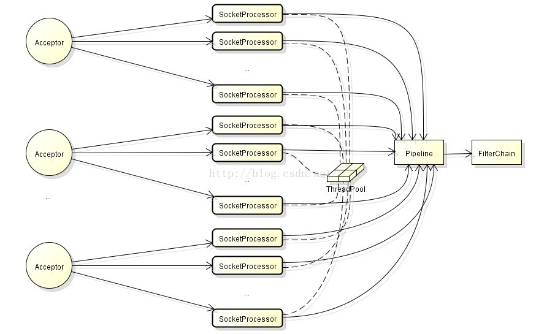

# [tomcat请求处理过程简介](https://blog.csdn.net/beliefer/article/details/51828607)

## 请求处理架构

- Tomcat请求处理架构图：

- 图列出了Tomcat请求处理架构中的主要组件，这里对它们做个简单介绍：
  - **Acceptor**：
    - 负责从ServerSocket中接收新的连接，并将Socket转交给SocketProcessor处理。Acceptor是JIoEndpoint的内部类。Acceptor线程的默认数量为1，我们可以在server.xml的Connector配置中增加acceptorThreadCount的大小。
  - **SocketProcessor**：
    - 负责对Acceptor转交的Socket进行处理，包括给Socket设置属性、读取请求行和请求头等，最终将处理交给Engine的Pipeline处理。
  - **ThreadPool**：
    - 执行SocketProcessor的线程来自线程池，此线程池默认的最小线程数minSpareThreads等于10，最大线程数maxThreads等于200，我们可以在server.xml的Connector配置中调整它们的大小。
  - **Pipeline**：
    - SocketProcessor线程最后会将请求进一步交给Engine容器的Pipeline，管道Pipeline包括一系列的valve，如：StandardEngineValve、AccessLogValve、ErrorReportValve、StandardHostValve、 StandardContextValve、 StandardWrapperValve，它们就像地下水管中的一个个阀门，每一个都会对请求数据做不同的处理。
  - **FilterChain**：
    - 管道Pipeline的最后一个valve是StandardWrapperValve，它会负责生成Servlet和Filter实例，并将它们组织成对请求处理的链条，这里正是Tomcat与J2EE规范相结合的部分。
- 默认情况下，Tomcat只有一个Acceptor线程，Acceptor不断循环从ServerSocket中获取Socket，当并发数大的情况下，这里会不会有性能问题？
  - Acceptor的实现非常轻量级，它只负责两个动作：获取Socket和将Socket转交给SocketProcessor线程处理。
  - 另外，我们可以通过在server.xml的Connector配置中增加acceptorThreadCount的值，让我们同时可以拥有多个Acceptor线程。
- SocketProcessor的线程数设置：
  - 如果你部署在Tomcat上的Web服务主要用于计算，那么CPU的开销势必会很大，那么线程数不宜设置的过大，一般以CPU核数\*2——CPU核数\*3最佳。
    - 当然如果计算量非常大，就已经超出了Tomcat的使用范畴，我想此时，选择离线计算框架Hadoop或者实时计算框架Storm、Spark才是更好的选择。
  - 如果部署在Tomcat上的Web服务主要是为了提供数据库访问，此时I/O的开销会很大，而CPU利用率反而低，此时应该将线程数设置的大一些。
    - 但是如果设置的过大，CPU为了给成百上千个线程分配时间片，造成CPU的精力都分散在线程切换上，反而造成性能下降。具体多大，需要对系统性能调优得出。