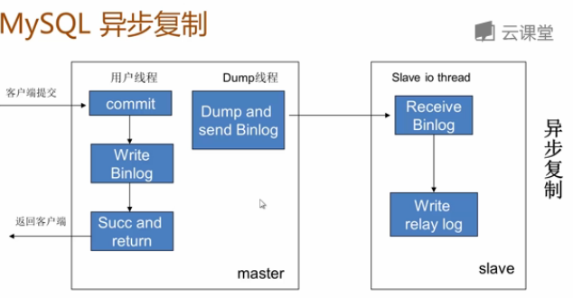
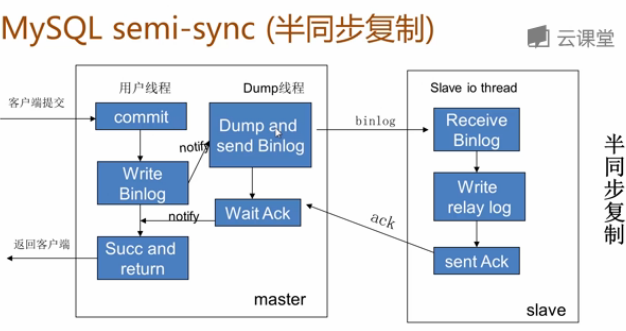

# [MySQL 主从复制原理](http://www.cnblogs.com/Aiapple/p/5792939.html)

### 主从形式

- MySQL主从复制：
  1. 一主一从
  2. 主主复制
  3. 一主多从---扩展系统读取的性能，因为读是在从库读取的；
  4. 多主一从---5.7开始支持
  5. 联级复制

### 用途及条件

- MySQL主从复制用途：
  - 实时灾备，用于故障切换。
  - 读写分离，提供查询服务。
  - 备份，避免影响业务。
- 主从部署必要条件：
  - 主库开启binlog日志（设置log-bin参数）。
  - 主从server-id不同。
  - 从库服务器能连通主库。

### 主从原理

- MySQL主从复制原理：
  - 从库生成两个线程，一个I/O线程，一个SQL线程；
  - i/o线程去请求主库 的binlog，并将得到的binlog日志写到relay log（中继日志） 文件中；
  - 主库会生成一个 log dump 线程，用来给从库 i/o线程传binlog；
  - SQL 线程，会读取relay log文件中的日志，并解析成具体操作，来实现主从的操作一致，而最终数据一致；

### 问题及解决方法

- MySQL主从复制存在的问题：
  - 主库宕机后，数据可能丢失。
  - 从库只有一个sql Thread，主库写压力大，复制很可能延时。
- 解决方法：
  - 半同步复制---解决数据丢失的问题。
  - 并行复制----解决从库复制延迟的问题。

### 半同步复制

- MySQL semi-sync（半同步复制）：
  - 5.5集成到MySQL，以插件的形式存在，需要单独安装。
  - 确保事务提交后binlog至少传输到一个从库。
  - 不保证从库应用完这个事务的binlog。
  - 性能有一定的降低，响应时间会更长。
  - 网络异常或从库宕机，**卡主主库，直到超时或从库恢复。**
- 主从复制：
  - 异步复制原理：
  - 半同步复制原理：

### 并行复制

- MySQL并行复制：
  - 社区版5.6中新增。
  - 并行是指从库多线程apply binlog。
  - 库级别并行应用binlog，同一个库数据更改还是串行的(5.7版并行复制基于事务组)。
- 设置：`set global slave_parallel_workers=10;`。
  - 设置sql线程数为10。

### 总结

- MySQL主从复制是MySQL高可用性，高性能（负载均衡）的基础。
- 简单，灵活，部署方式多样，可以根据不同业务场景部署不同复制结构。
- 复制过程中应该时刻监控复制状态，复制出错或延时可能给系统造成影响
- MySQL主从复制目前也存在一些问题，可以根据需要部署复制增强功能。