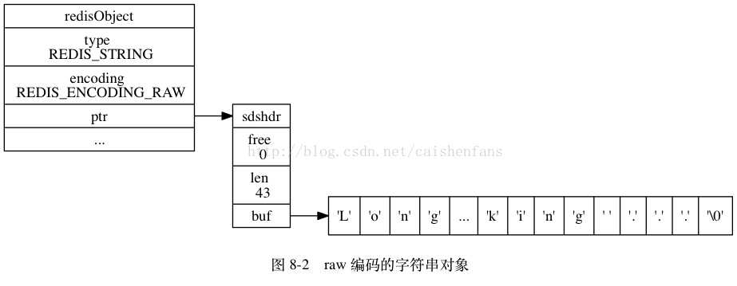
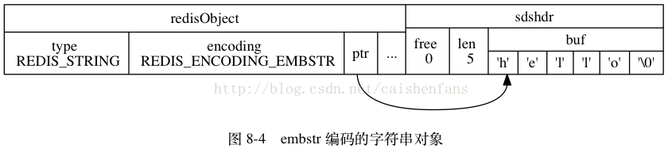
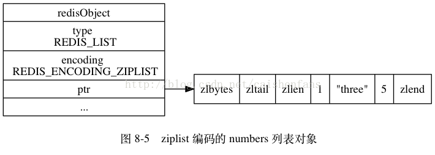
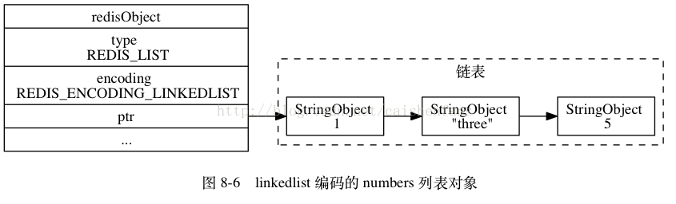
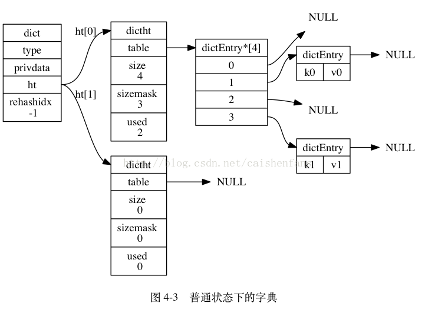
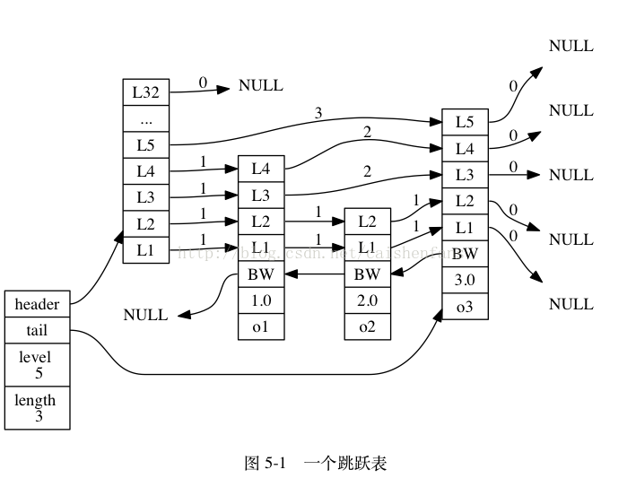

# [Redis的五种对象类型及其底层实现](https://blog.csdn.net/caishenfans/article/details/44784131)

### 简介

- Redis共有五种对象的类型，分别是：

| 类型常量       | 对象的名称   |
| -------------- | ------------ |
| `REDIS_STRING` | 字符串对象   |
| `REDIS_LIST`   | 列表对象     |
| `REDIS_HASH`   | 哈希对象     |
| `REDIS_SET`    | 集合对象     |
| `REDIS_ZSET`   | 有序集合对象 |

- Redis中的一个对象的结构体表示如下：

```c
/* 
 * Redis 对象 
 */  
typedef struct redisObject {  
  
    // 类型  
    unsigned type:4;          
  
    // 不使用(对齐位)  
    unsigned notused:2;  
  
    // 编码方式  
    unsigned encoding:4;  
  
    // LRU 时间（相对于 server.lruclock）  
    unsigned lru:22;  
  
    // 引用计数  
    int refcount;  
  
    // 指向对象的值  
    void *ptr;  
  
} robj;  
```

- type表示了该对象的对象类型，即上面五个中的一个。但为了提高存储效率与程序执行效率，每种对象的底层数据结构实现都可能不止一种。encoding就表示了对象底层所使用的编码。下面先介绍每种底层数据结构的实现，再介绍每种对象类型都用了什么底层结构并分析他们之间的关系。

### Redis对象底层数据结构

- 底层数据结构共有八种，如下表所示：

| 编码常量                    | 编码所对应的底层数据结构      |
| --------------------------- | ----------------------------- |
| `REDIS_ENCODING_INT`        | `long` 类型的整数             |
| `REDIS_ENCODING_EMBSTR`     | `embstr` 编码的简单动态字符串 |
| `REDIS_ENCODING_RAW`        | 简单动态字符串                |
| `REDIS_ENCODING_HT`         | 字典                          |
| `REDIS_ENCODING_LINKEDLIST` | 双端链表                      |
| `REDIS_ENCODING_ZIPLIST`    | 压缩列表                      |
| `REDIS_ENCODING_INTSET`     | 整数集合                      |
| `REDIS_ENCODING_SKIPLIST`   | 跳跃表和字典                  |

### 字符串对象

- 字符串对象的编码可以是int、raw或者embstr。
- 如果一个字符串的内容可以转换为long，那么该字符串就会被转换成为long类型，对象的ptr就会指向该long，并且对象类型也用int类型表示。
- 普通的字符串有两种，embstr和raw。embstr应该是Redis 3.0新增的数据结构,在2.8中是没有的。如果字符串对象的长度小于39字节，就用embstr对象。否则用传统的raw对象。可以从下面这段代码看出：

```c
#define REDIS_ENCODING_EMBSTR_SIZE_LIMIT 39  
robj *createStringObject(char *ptr, size_t len) {  
    if (len <= REDIS_ENCODING_EMBSTR_SIZE_LIMIT)  
        return createEmbeddedStringObject(ptr,len);  
    else  
        return createRawStringObject(ptr,len);  
}
```

- embstr的好处有如下几点：
  - embstr的创建只需分配一次内存，而raw为两次（一次为sds分配对象，另一次为objet分配对象，embstr省去了第一次）。
  - 相对地，释放内存的次数也由两次变为一次。
  - embstr的objet和sds放在一起，更好地利用缓存带来的优势。
- 需要注意的是，redis并未提供任何修改embstr的方式，即embstr是只读的形式。对embstr的修改实际上是先转换为raw再进行修改。
- raw和embstr的区别可以用下面两幅图所示：





### 列表对象

- 列表对象的编码可以是ziplist或者linkedlist。
- ziplist是一种压缩链表，它的好处是更能节省内存空间，因为它所存储的内容都是在连续的内存区域当中的。
- 当列表对象元素不大，每个元素也不大的时候，就采用ziplist存储。但当数据量过大时就ziplist就不是那么好用了。因为为了保证他存储内容在内存中的连续性，插入的复杂度是O(N)，即每次插入都会重新进行realloc。
- 如下图所示，对象结构中ptr所指向的就是一个ziplist。整个ziplist只需要malloc一次，它们在内存中是一块连续的区域。



- linkedlist是一种双向链表。它的结构比较简单，节点中存放pre和next两个指针，还有节点相关的信息。当每增加一个node的时候，就需要重新malloc一块内存。



### 哈希对象

- 哈希对象的底层实现可以是ziplist或者hashtable。
- ziplist中的哈希对象是按照key1,value1,key2,value2这样的顺序存放来存储的。当对象数目不多且内容不大时，这种方式效率是很高的。
- hashtable的是由dict这个结构来实现的：

```c
typedef struct dict {  
    dictType *type;  
    void *privdata;  
    dictht ht[2];  
    long rehashidx; /* rehashing not in progress if rehashidx == -1 */  
    int iterators; /* number of iterators currently running */  
} dict;  
```

- dict是一个字典，其中的指针dicht ht[2] 指向了两个哈希表：

```c
typedef struct dictht {  
    dictEntry **table;  
    unsigned long size;  
    unsigned long sizemask;  
    unsigned long used;  
} dictht;
```

- dicht[0] 是用于真正存放数据，dicht[1]一般在哈希表元素过多进行rehash的时候用于中转数据。
- dictht中的table用语真正存放元素了，每个key/value对用一个dictEntry表示，放在dictEntry数组中。



### 集合对象

- 集合对象的编码可以是intset或者hashtable。
- intset是一个整数集合，里面存的为某种同一类型的整数，支持如下三种长度的整数：

```c
#define INTSET_ENC_INT16 (sizeof(int16_t))  
#define INTSET_ENC_INT32 (sizeof(int32_t))  
#define INTSET_ENC_INT64 (sizeof(int64_t))  
```

- intset是一个有序集合，查找元素的复杂度为O(logN)，但插入时不一定为O(logN)，因为有可能涉及到升级操作。比如当集合里全是int16_t型的整数，这时要插入一个int32_t，那么为了维持集合中数据类型的一致，那么所有的数据都会被转换成int32_t类型，涉及到内存的重新分配，这时插入的复杂度就为O(N)了。
- intset不支持降级操作。

### 有序集合对象

- 有序集合的编码可能两种，一种是ziplist，另一种是skiplist与dict的结合。
- ziplist作为集合和作为哈希对象是一样的，member和score顺序存放。按照score从小到大顺序排列。它的结构不再复述。
- skiplist是一种跳跃表，它实现了有序集合中的快速查找，在大多数情况下它的速度都可以和平衡树差不多。但它的实现比较简单，可以作为平衡树的替代品。它的结构比较特殊。下面分别是跳跃表skiplist和它内部的节点skiplistNode的结构体：

```c
/* 
 * 跳跃表 
 */  
typedef struct zskiplist {  
    // 头节点，尾节点  
    struct zskiplistNode *header, *tail;  
    // 节点数量  
    unsigned long length;  
    // 目前表内节点的最大层数  
    int level;  
} zskiplist;  
/* ZSETs use a specialized version of Skiplists */  
/* 
 * 跳跃表节点 
 */  
typedef struct zskiplistNode {  
    // member 对象  
    robj *obj;  
    // 分值  
    double score;  
    // 后退指针  
    struct zskiplistNode *backward;  
    // 层  
    struct zskiplistLevel {  
        // 前进指针  
        struct zskiplistNode *forward;  
        // 这个层跨越的节点数量  
        unsigned int span;  
    } level[];  
} zskiplistNode;  
```

- head和tail分别指向头节点和尾节点，然后每个skiplistNode里面的结构又是分层的(即level数组)

  用图表示，大概是下面这个样子：



- 每一列都代表一个节点，保存了member和score，按score从小到大排序。每个节点有不同的层数，这个层数是在生成节点的时候随机生成的数值。每一层都是一个指向后面某个节点的指针。这种结构使得跳跃表可以跨越很多节点来快速访问。
- 前面说到了，有序集合ZSET是有跳跃表和hashtable共同形成的。

```c
typedef struct zset {  
    // 字典  
    dict *dict;  
    // 跳跃表  
    zskiplist *zsl;  
} zset;  
```

- 为什么要用这种结构呢。试想如果单一用hashtable，那可以快速查找、添加和删除元素，但没法保持集合的有序性。如果单一用skiplist，有序性可以得到保障，但查找的速度太慢O（logN）。

### 结尾

- 简单介绍了Redis的五种对象类型和它们的底层实现。事实上，Redis的高效性和灵活性正是得益于对于同一个对象类型采取不同的底层结构，并在必要的时候对二者进行转换；以及各种底层结构对内存的合理利用