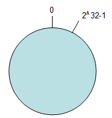
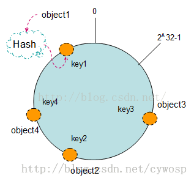
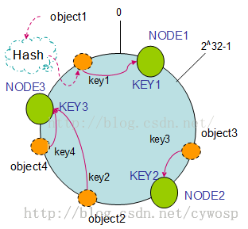
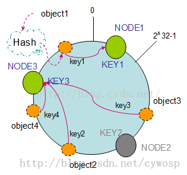
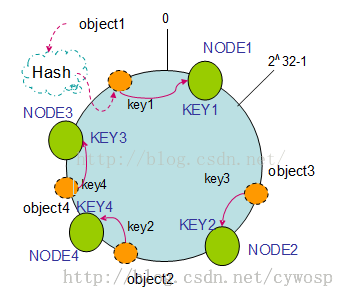
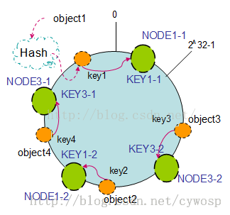
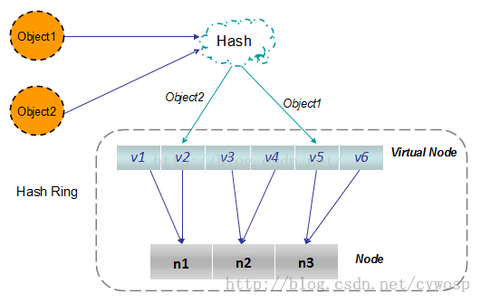

# [一致性哈希算法](https://blog.csdn.net/u010558660/article/details/52767218)

- 一致性哈希算法是分布式系统中常用的算法。比如，一个分布式的存储系统，要将数据存储到具体的节点上，
  如果采用普通的hash方法，将数据映射到具体的节点上，如key%N，key是数据的key，N是机器节点数，
  如果有一个机器加入或退出这个集群，则所有的数据映射都无效了。
- 一致性哈希算法解决了普通余数Hash算法伸缩性差的问题，可以保证在上线、下线服务器的情况下尽量有多的请求命中原来路由到的服务器。

### 原理

##### 环形Hash空间

- 按照常用的hash算法来将对应的key哈希到一个具有2^32次方个桶的空间中，即0~(2^32)-1的数字空间中。

  现在我们可以将这些数字头尾相连，想象成一个闭合的环形。如下图：



##### 把数据通过一定的hash算法处理后映射到环上

- 现在我们将object1、object2、object3、object4四个对象通过特定的Hash函数计算出对应的key值，然后散列到Hash环上。如下图：

```Java
Hash(object1) = key1;
Hash(object2) = key2;
Hash(object3) = key3;
Hash(object4) = key4;
```



##### 将机器通过hash算法映射到环上

- 在采用一致性哈希算法的分布式集群中将新的机器加入，其原理是通过使用与对象存储一样的Hash算法将机器也映射到环中。
- （一般情况下对机器的hash计算是采用机器的IP或者机器唯一的别名作为输入值），然后以顺时针的方向计算，将所有对象存储到离自己最近的机器中。
- 假设现在有NODE1，NODE2，NODE3三台机器，通过Hash算法得到对应的KEY值，映射到环中，其示意图如下：

```Java
Hash(NODE1) = KEY1;
Hash(NODE2) = KEY2;
Hash(NODE3) = KEY3;
```



- 通过上图可以看出对象与机器处于同一哈希空间中，这样按顺时针转动object1存储到了NODE1中，object3存储到了NODE2中，object2、object4存储到了NODE3中。
- 在这样的部署环境中，hash环是不会变更的，因此，通过算出对象的hash值就能快速的定位到对应的机器中，这样就能找到对象真正的存储位置了。

### 机器的删除与添加

- 普通hash求余算法最为不妥的地方就是在有机器的添加或者删除之后会造成大量的对象存储位置失效。下面来分析一下一致性哈希算法是如何处理的。

  1. **节点（机器）的删除**

     - 以上面的分布为例，如果NODE2出现故障被删除了，那么按照顺时针迁移的方法，object3将会被迁移到NODE3中，这样仅仅是object3的映射位置发生了变化，其它的对象没有任何的改动。如下图：

     

  2. **节点（机器）的添加 **

     - 如果往集群中添加一个新的节点NODE4，通过对应的哈希算法得到KEY4，并映射到环中，如下图：

     

     - 通过按顺时针迁移的规则，那么object2被迁移到了NODE4中，其它对象还保持着原有的存储位置。
     - 通过对节点的添加和删除的分析，一致性哈希算法在保持了单调性的同时，还是数据的迁移达到了最小，这样的算法对分布式集群来说是非常合适的，避免了大量数据迁移，减小了服务器的的压力。

### 平衡性--虚拟节点

- 根据上面的图解分析，一致性哈希算法满足了单调性和负载均衡的特性以及一般hash算法的分散性，但这还并不能当做其被广泛应用的原由，因为还缺少了平衡性。下面将分析一致性哈希算法是如何满足平衡性的。
- hash算法是不保证平衡的，如上面只部署了NODE1和NODE3的情况（NODE2被删除的图），object1存储到了NODE1中，而object2、object3、object4都存储到了NODE3中，这样就造成了非常不平衡的状态。在一致性哈希算法中，为了尽可能的满足平衡性，其引入了虚拟节点。
- ——“虚拟节点”（ virtual node ）是实际节点（机器）在 hash 空间的复制品（ replica ），一个实际节点（机器）对应了若干个“虚拟节点”，这个对应个数也成为“复制个数”，“虚拟节点”在 hash 空间中以hash值排列。
- 以上面只部署了NODE1和NODE3的情况（NODE2被删除的图）为例，之前的对象在机器上的分布很不均衡，现在我们以2个副本（复制个数）为例，这样整个hash环中就存在了4个虚拟节点，最后对象映射的关系图如下：



- 根据上图可知对象的映射关系：object1->NODE1-1，object2->NODE1-2，object3->NODE3-2，object4->NODE3-1。通过虚拟节点的引入，对象的分布就比较均衡了。那么在实际操作中，正真的对象查询是如何工作的呢？对象从hash到虚拟节点到实际节点的转换如下图：



- “虚拟节点”的hash计算可以采用对应节点的IP地址加数字后缀的方式。例如假设NODE1的IP地址为192.168.1.100。引入“虚拟节点”前，计算 cache A 的 hash 值：

  `Hash(“192.168.1.100”);`

- 引入“虚拟节点”后，计算“虚拟节”点NODE1-1和NODE1-2的hash值：
  `Hash(“192.168.1.100#1”); // NODE1-1`
  `Hash(“192.168.1.100#2”); // NODE1-2`