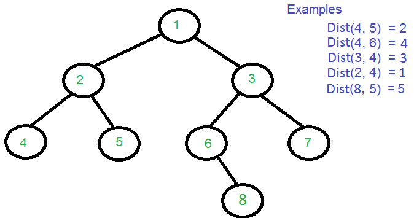

# 二叉树的相关算法

### 层次遍历

1. 将根节点入队中。
2. 当队列非空时，循环执行步骤3至5，否则执行步骤6。
3. 获取队列第一个节点，访问该节点。
4. 如果该节点的左子树不为空，则将左子树入队。
5. 如果该节点的右子树不为空，则将右子树入队。
6. 结束。

### [前中后序遍历](https://www.cnblogs.com/SHERO-Vae/p/5800363.html)

#### 前序遍历

- 前序遍历按照“根结点-左孩子-右孩子”的顺序进行访问。

##### 递归实现

```c++
void preOrder1(BinTree *root)     //递归前序遍历 
{
    if(root!=NULL)
    {
        cout<<root->data<<" ";
        preOrder1(root->lchild);
        preOrder1(root->rchild);
    }
}
```

##### 非递归实现

- 根据前序遍历访问的顺序，优先访问根结点，然后再分别访问左孩子和右孩子。即对于任一结点，其可看做是根结点，因此可以直接访问，访问完之后，若其左孩子不为空，按相同规则访问它的左子树；当访问其左子树时，再访问它的右子树。因此其处理过程如下：
- 对于任一结点P：
  1. 访问结点P，并将结点P入栈；
  2. 判断结点P的左孩子是否为空。
     - 若为空，则取栈顶结点并进行出栈操作，并将栈顶结点的右孩子置为当前的结点P，循环至步骤1；
     - 若不为空，则将P的左孩子置为当前的结点P；
  3. 直到P为NULL并且栈为空，则遍历结束。

```c++
void preOrder2(BinTree *root)     //非递归前序遍历 
{
    stack<BinTree*> s;
    BinTree *p=root;
    while(p!=NULL||!s.empty())
    {
        while(p!=NULL)
        {
            cout<<p->data<<" ";
            s.push(p);
            p=p->lchild;
        }
        if(!s.empty())
        {
            p=s.top();
            s.pop();
            p=p->rchild;
        }
    }
}
```

#### 中序遍历

- 中序遍历按照“左孩子-根结点-右孩子”的顺序进行访问。

##### 递归实现

```c++
void inOrder1(BinTree *root)      //递归中序遍历
{
    if(root!=NULL)
    {
        inOrder1(root->lchild);
        cout<<root->data<<" ";
        inOrder1(root->rchild);
    }
}
```

##### 非递归实现

- 根据中序遍历的顺序，对于任一结点，优先访问其左孩子，而左孩子结点又可以看做一根结点，然后继续访问其左孩子结点，直到遇到左孩子结点为空的结点才进行访问，然后按相同的规则访问其右子树。因此其处理过程如下：
  1. 若其左孩子不为空，则将P入栈并将P的左孩子置为当前的P，然后对当前结点P再进行相同的处理；
  2. 若其左孩子为空，则取栈顶元素并进行出栈操作，访问该栈顶结点，然后将当前的P置为栈顶结点的右孩子；
  3. 直到P为NULL并且栈为空则遍历结束。

```c++
void inOrder2(BinTree *root)      //非递归中序遍历
{
    stack<BinTree*> s;
    BinTree *p=root;
    while(p!=NULL||!s.empty())
    {
        while(p!=NULL)
        {
            s.push(p);
            p=p->lchild;
        }
        if(!s.empty())
        {
            p=s.top();
            cout<<p->data<<" ";
            s.pop();
            p=p->rchild;
        }
    }    
}
```

#### 后序遍历

- 后序遍历按照“左孩子-右孩子-根结点”的顺序进行访问。

##### 递归实现

```c++
void postOrder1(BinTree *root)    //递归后序遍历
{
    if(root!=NULL)
    {
        postOrder1(root->lchild);
        postOrder1(root->rchild);
        cout<<root->data<<" ";
    }    
}
```

##### 非递归实现

- 后序遍历的非递归实现是三种遍历方式中最难的一种。因为在后序遍历中，要保证左孩子和右孩子都已被访问并且左孩子在右孩子前访问才能访问根结点，这就为流程的控制带来了难题。下面介绍两种思路。
- 第一种思路：
  - 对于任一结点P，将其入栈，然后沿其左子树一直往下搜索，直到搜索到没有左孩子的结点，此时该结点出现在栈顶，但是此时不能将其出栈并访问， 因此其右孩子还未被访问。
  - 所以接下来按照相同的规则对其右子树进行相同的处理，当访问完其右孩子时，该结点又出现在栈顶，此时可以将其出栈并访问，这样就保证了正确的访问顺序。
  - 可以看出，在这个过程中，每个结点都两次出现在栈顶，只有在第二次出现在栈顶时，才能访问它。
  - 因此需要多设置一个变量标识该结点是否是第一次出现在栈顶。

```c++
void postOrder2(BinTree *root)    //非递归后序遍历
{
    stack<BTNode*> s;
    BinTree *p=root;
    BTNode *temp;
    while(p!=NULL||!s.empty())
    {
        while(p!=NULL)              //沿左子树一直往下搜索，直至出现没有左子树的结点 
        {
            BTNode *btn=(BTNode *)malloc(sizeof(BTNode));
            btn->btnode=p;
            btn->isFirst=true;
            s.push(btn);
            p=p->lchild;
        }
        if(!s.empty())
        {
            temp=s.top();
            s.pop();
            if(temp->isFirst==true)     //表示是第一次出现在栈顶 
             {
                temp->isFirst=false;
                s.push(temp);
                p=temp->btnode->rchild;    
            }
            else                        //第二次出现在栈顶 
             {
                cout<<temp->btnode->data<<" ";
                p=NULL;
            }
        }
    }    
}
```

- 第二种思路：
  - 要保证根结点在左孩子和右孩子访问之后才能访问，因此对于任一结点P，先将其入栈。
  - 如果P不存在左孩子和右孩子，则可以直接访问它；
  - 或者P存在左孩子或者右孩子，但是其左孩子和右孩子都已被访问过了，则同样可以直接访问该结点。
  - 若非上述两种情况，则将P的右孩子和左孩子依次入栈，这样就保证了 每次取栈顶元素的时候，左孩子在右孩子前面被访问，左孩子和右孩子都在根结点前面被访问。

```c++
void postOrder3(BinTree *root)     //非递归后序遍历
{
    stack<BinTree*> s;
    BinTree *cur;                      //当前结点 
    BinTree *pre=NULL;                 //前一次访问的结点 
    s.push(root);
    while(!s.empty())
    {
        cur=s.top();
        if((cur->lchild==NULL&&cur->rchild==NULL)||
           (pre!=NULL&&(pre==cur->lchild||pre==cur->rchild)))
        {
            cout<<cur->data<<" ";  //如果当前结点没有孩子结点或者孩子节点都已被访问过 
              s.pop();
            pre=cur; 
        }
        else
        {
            if(cur->rchild!=NULL)
                s.push(cur->rchild);
            if(cur->lchild!=NULL)    
                s.push(cur->lchild);
        }
    }    
}
```

### [二叉树中两个结点的距离](http://blog.csdn.net/zhangyongzhen1991/article/details/51126434)

- 对于给定的一个二叉树以及里面的两个结点，求出两个结点最小距离。

##### 分析



- 假设给定的节点为node1, node2，可以分为下面两种情况：
  1. node1是node2的祖先节点或孩子节点，可以理解为两个节点在一条线上。 例如：Dist(2,4), Dist(6,1)。
  2. node1和node2没有直接或间接的父子关系。 例如，Dist(4,3)， 他们需要一个共同的祖先节点1 连接起来。
- 通过观察可以总结出下面的公式, lca是两个节点的最低公共祖先节点:
  - `Dist(n1, n2) = Dist(root, n1) + Dist(root, n2) - 2 * Dist(root, lca) `
- 这个公式已经含盖了上面的两种情况。先找出lca，再求root节点到某个节点的距离就比较简单了。
- 下面是Java代码实现：

```Java
class Node{
    Node left,right;
    int key;
 
    public Node(int i) {
        this.key = i;
    }
} 

public class TreeNodesDistance {
    //返回node节点在root中的第几层，-1表示没有在root子树下找到
    public static int findLevel(Node root, int node){
        
        if(root == null) return -1;
        if(root.key == node) return 0;
        
        //先在左子树查找
        int level = findLevel(root.left, node);
        //左子树没有找到则到右子树查找
        if(level == -1){
           level = findLevel(root.right, node);
        }
        if(level != -1)
            return level+1;
        return -1;
    }

    public static Node findLCA(Node root, int node1,int node2){
        
        if(root == null) return null;
 
        //找到两个节点中的一个就返回
        if(root.key == node1 || root.key == node2){
            return root;
        }
        
        //分别在左右子树查找两个节点
        Node left_lca = findLCA(root.left, node1, node2);
        Node right_lca = findLCA(root.right, node1, node2);
        
        if(left_lca != null && right_lca != null){
            //此时说明，两个节点肯定是分别在左右子树中，当前节点比为LCA
            return root;
        }
        
        return left_lca != null ? left_lca : right_lca;
    }
    
    public static int distanceNodes(Node root, int node1, int node2){
        Node lca = findLCA(root, node1, node2);
        int dis_lca = findLevel(root, lca.key);
        int dis1 = findLevel(root, node1);
        int dis2 = findLevel(root, node2);
        return dis1 + dis2 - 2*dis_lca;
    }
}
```

### [二叉树的最大距离](http://blog.csdn.net/liuyi1207164339/article/details/50898902)

- 求二叉树相距最远的两个叶子节点的距离。
- 计算一个二叉树的最大距离有两个情况：
  - **情况A: 路径经过左子树的最深节点，通过根节点，再到右子树的最深节点。**
  - **情况B: 路径不穿过根节点，而是左子树或右子树的最大距离路径，取其大者。**
- 对于情况A来说，只需要知道左右子树的深度，然后加起来即可。
- 对于情况B来说，需要知道左子树的最远距离，右子树的最远距离。
- 只需要计算这两种情况的路径距离，并取其最大值，就是该二叉树的最大距离。
- 代码如下：

```c++
//改进的版本  
int HeightOfBinaryTree(BinaryTreeNode*pNode, int&nMaxDistance){  
    if (pNode == NULL)  
        return -1;   //空节点的高度为-1  
    //递归  
    int nHeightOfLeftTree = HeightOfBinaryTree(pNode->m_pLeft, nMaxDistance) + 1;   //左子树的的高度加1  
    int nHeightOfRightTree = HeightOfBinaryTree(pNode->m_pRight, nMaxDistance) + 1;   //右子树的高度加1  
    int nDistance = nHeightOfLeftTree + nHeightOfRightTree + 2;    //距离等于左子树的高度加上右子树的高度+2  
    nMaxDistance = nMaxDistance > nDistance ? nMaxDistance : nDistance;            //得到距离的最大值  
    return nHeightOfLeftTree > nHeightOfRightTree ? nHeightOfLeftTree : nHeightOfRightTree;  
}  
```

- 注：这里的高度是以叶子高度为0作为基准。

### [求二叉树的深度和宽度](http://blog.csdn.net/K346K346/article/details/51076268)

#### 二叉树的深度

- 我们可以从根节点即左右子树来理解二叉树的深度。对于任意一棵非空二叉树，有如下四种情况：
  1. 如果一颗树只有一个节点，它的深度是1；
  2. 如果根节点只有左子树而没有右子树，那么二叉树的深度应该是其左子树的深度加1；
  3. 如果根节点只有右子树而没有左子树，那么二叉树的深度应该是其右树的深度加1；
  4. 如果根节点既有左子树又有右子树，那么二叉树的深度应该是其左右子树的深度较大值加1；

```c++
int treeDepth(BinaryTreeNode* root){
    if(root==NULL){
        return 0;
    }
    int nLeft=treeDepth(root->m_pLeft);
    int nRight=treeDepth(root->m_pRight);
    return nLeft>nRight?nLeft+1:nRight+1;
}
```

#### 二叉树的宽度

- 二叉树的宽度定义为具有最多结点数的层中包含的结点数。
- **求解思路：** 
  - 这里需要用到二叉树的层次遍历，即广度优先搜索。
  - 在层次遍历的过程中，通过读取队列中保留的上一层的节点数来记录每层的节点数，以获取所有层中最大的节点数。

```c++
//求二叉树的宽度  
int treeWidth(BinaryTreeNode *pRoot){  
    if (pRoot == NULL)
        return 0;  

    int nLastLevelWidth = 0;//记录上一层的宽度  
    int nCurLevelWidth = 0;//记录当前层的宽度  

    queue<BinaryTreeNode*> myQueue;  
    myQueue.push(pRoot);//将根节点入队列  
    int nWidth = 1;//二叉树的宽度  
    nLastLevelWidth = 1;      
    BinaryTreeNode *pCur = NULL;  

    while (!myQueue.empty())//队列不空  
    {  
        while (nLastLevelWidth!= 0){  
            pCur = myQueue.front();//取出队列头元素  
            myQueue.pop();//将队列头元素出对  

            if (pCur->m_pLeft != NULL)  
                myQueue.push(pCur->m_pLeft);   

            if (pCur->m_pRight != NULL)  
                myQueue.push(pCur->m_pRight); 
            nLastLevelWidth--;  
        }  

        nCurLevelWidth = myQueue.size();  
        nWidth = nCurLevelWidth > nWidth ? nCurLevelWidth : nWidth;  
        nLastLevelWidth = nCurLevelWidth;  
    }  
    return nWidth;  
}
```

