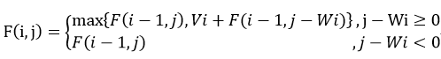

# 背包问题

### 题目

- 给定n个重量为W1，W2，…，Wn价值为V1，V2，…，Vn的物品和一个承重量为W的背包，求这些物品中最有价值的一个子集，并且能够装到背包中。
- 这个问题有个简单的解法，即穷举法。

### 动态规划算法

- 为了设计一个动态规划算法，需要推导出一个递推关系，用较小的实例的解法的形式来表示背包问题的实例的解。

##### 思路

- 考虑一个由前 i 个物品（1 ≤ i ≤ n）定义的实例，物品的重量分别为W1，W2，…，Wi，价值分别为V1，V2，…，Vi，背包的承重量为j（1 ≤ j ≤ W）。

- 设F(i, j)为该实例的最优解的物品总价值，即能够放进承重量为 j 的背包中的前 i 个物品中最有价值子集的总价值。

- 可以把前 i 个物品中能够放进承重量为 j 的背包中子集分成两个类别：包括第 i 个物品的子集和不包括第 i 个物品的子集。

- 得出下面的结论：

  1. 在不包括第 i 个物品的子集中，最优子集的价值是F(i-1, j)。
  2. 在包括第 i 个物品的子集中（因此，j - Wi ≥ 0），最优子集是由该物品和前 i-1 个物品中能够放进承重量为 j-Wi 的背包的最优子集组成。总价值等于 Vi + F(i-1, j-Wi)。

- 得出下面这个递推式：

  

  ​

- 定义初始条件：

  - 当 j ≥ 0 时，F(0, j) = 0；
  - 当 i ≥ 0 时，F(i, 0) = 0。

- 用表格的形式显示，直观看出F(i,j)的计算。

|      | 0    | j-Wi         | ……| j        |…… | W    |
| ---- | ---- | ------------ | --------- | ---- | ---- | ---- |
| 0    | 0    | 0            | 0         | 0    |0|0|
| ……   | 0 |              |           |      |||
| i-1  | 0    | F(i-1, j-Wi) |  | F(i-1, j) |||
| i | 0 |  | | F(i,j) |||
| …… | 0 |  | |  |||
| n | 0 |  | |  ||目标|

##### 例子

- 给出数据：

| 物品 | 重量 | 价值/美元 |
| ---- | ---- | --------- |
| 1    | 2    | 12        |
| 2    | 1    | 10        |
| 3    | 3    | 20        |
| 4    | 2    | 15        |

- 给出用公式填写的动态规划表。

| i    | 0    | 1    | 2    | 3    | 4    | 5    |
| ---- | ---- | ---- | ---- | ---- | ---- | ---- |
| 0    | 0    | 0    | 0    | 0    | 0    | 0    |
| 0    | 0    | 0    | 12   | 12   | 12   | 12   |
| 2    | 0    | 10   | 12   | 22   | 22   | 22   |
| 3    | 0    | 10   | 12   | 22   | 30   | 32   |
| 4    | 0    | 10   | 15   | 25   | 30   | 37   |

- 调用F(4,5)，其会递归计算出所需要的相关数据，表中给出的是全部的数据，实际上需要计算的数据并不多。

### 效率

- 该算法的时间效率和空间效率都属于Θ（nW）。