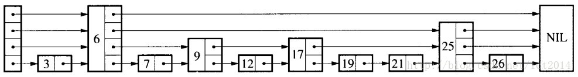
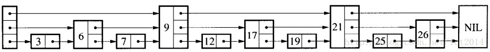
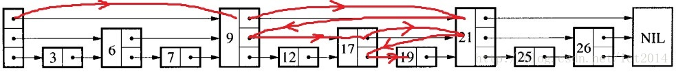
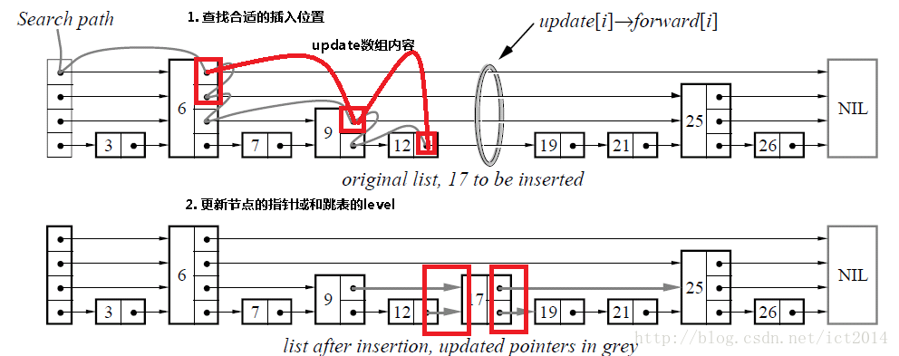
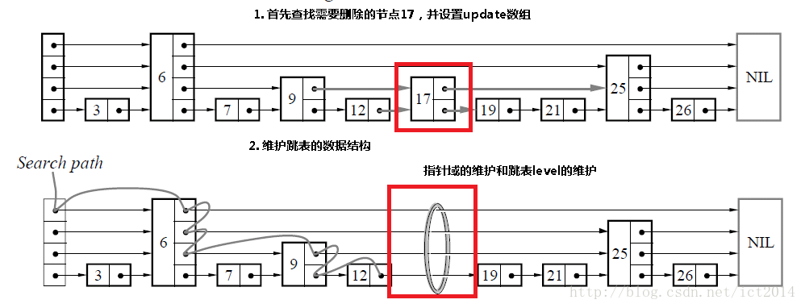

# [跳跃表原理](https://blog.csdn.net/ict2014/article/details/17394259)

### 跳跃表的简单示例

- 每一个结点不单单只包含指向下一个结点的指针，可能包含很多个指向后续结点的指针，这样就可以跳过一些不必要的结点，从而加快查找、删除等操作。
- 对于一个链表内每一个结点包含多少个指向后续元素的指针，这个过程是通过一个随机函数生成器得到，这样子就构成了一个跳跃表。

### 查找

- 查找就是给定一个key，查找这个key是否出现在跳跃表中，如果出现，则返回其值，如果不存在，则返回不存在。我们结合一个图就是讲解查找操作，如下图4所示：

- 如果我们想查找19是否存在？如何查找呢？我们从头结点开始，首先和9进行判断，此时大于9，然后和21进行判断，小于21，此时这个值肯定在9结点和21结点之间，此时，我们和17进行判断，大于17，然后和21进行判断，小于21，此时肯定在17结点和21结点之间，此时和19进行判断，找到了。具体的示意图如图所示：

### 插入

- 插入包含如下几个操作：1、查找到需要插入的位置   2、申请新的结点    3、调整指针。
- 我们结合下图进行讲解，查找如下图的灰色的线所示，申请新的结点如17结点所示， 调整指向新结点17的指针以及17结点指向后续结点的指针。

### 删除

- 删除操作类似于插入操作，包含如下3步：1、查找到需要删除的结点 2、删除结点  3、调整指针。

