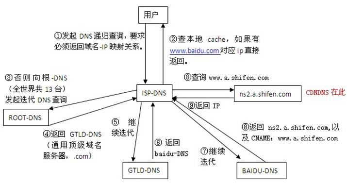

# [DNS解析完整流程](https://jingyan.baidu.com/article/86fae346e9d33e3c49121acb.html)

1. 本地客户机提出域名解析请求，查找本地HOST文件后将该请求发送给本地的域名服务器。
2. 当本地的域名服务器收到请求后，就先查询本地的缓存，如果有该纪录项，则本地的域名服务器就直接把查询的结果返回。
3. 如果本地DNS缓存中没有该纪录，则本地域名服务器就直接把请求发给根域名服务器，然后根域名服务器再返回给本地域名服务器一个所查询域（根的子域）的主域名服务器的地址。
4. 本地服务器再向上一步返回的域名服务器发送请求，然后接受请求的服务器查询自己的缓存，如果没有该纪录，则返回相关的下级的域名服务器的地址。
5. 重复第四步，直到找到正确的纪录。
6. 本地域名服务器把返回的结果保存到缓存，以备下一次使用，同时还将结果返回给客户机。

### 递归查询与迭代查询

- 递归查询：
  - 在该模式下DNS服务器接收到客户机请求，必须使用一个准确的查询结果回复客户机。
  - 如果DNS服务器本地没有存储查询DNS信息，那么该服务器会询问其他服务器，并将返回的查询结果提交给客户机。
- 迭代查询：
  - DNS所在服务器若没有可以响应的结果，会向客户机提供其他能够解析查询请求的DNS服务器地址，当客户机发送查询请求时，DNS服务器并不直接回复查询结果，而是告诉客户机另一台DNS服务器地址，客户机再向这台DNS服务器提交请求，依次循环直到返回查询的结果为止。
- 用户和本地服务器之间是递归查询，本地服务器的查询过程是迭代查询。

### 使用的报文

- DNS同时占用UDP和TCP端口53是公认的，这种单个应用协议同时使用两种传输协议的情况在TCP/IP栈也算是个另类。但很少有人知道DNS分别在什么情况下使用这两种协议。 
- DNS在进行区域传输的时候使用TCP协议，其它时候则使用UDP协议； 
  - DNS的规范规定了2种类型的DNS服务器，一个叫主DNS服务器，一个叫辅助DNS服务器。在一个区中主DNS服务器从自己本机的数据文件中读取该区的DNS数据信息，而辅助DNS服务器则从区的主DNS服务器中读取该区的DNS数据信息。当一个辅助DNS服务器启动时，它需要与主DNS服务器通信，并加载数据信息，这就叫做区传送（zone transfer）。 
- 为什么既使用TCP又使用UDP？ 
  - 首先了解一下TCP与UDP传送字节的长度限制： 
    - UDP报文的最大长度为512字节，而TCP则允许报文长度超过512字节。
  - 当DNS查询超过512字节时，协议的TC标志出现删除标志，这时则使用TCP发送。通常传统的UDP报文一般不会大于512字节。 
- 区域传送时使用TCP，主要有一下两点考虑： 
  1. 辅域名服务器会定时（一般时3小时）向主域名服务器进行查询以便了解数据是否有变动。如有变动，则会执行一次区域传送，进行数据同步。区域传送将使用TCP而不是UDP，因为数据同步传送的数据量比一个请求和应答的数据量要多得多。 
  2. TCP是一种可靠的连接，保证了数据的准确性。 
- 域名解析时使用UDP协议： 
  - 客户端向DNS服务器查询域名，一般返回的内容都不超过512字节，用UDP传输即可。不用经过TCP三次握手，这样DNS服务器负载更低，响应更快。虽然从理论上说，客户端也可以指定向DNS服务器查询的时候使用TCP，但事实上，很多DNS服务器进行配置的时候，仅支持UDP查询包。