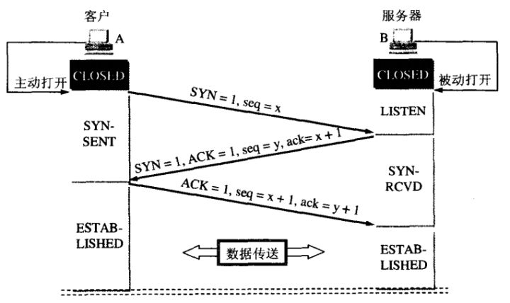

# TCP的三次握手和四次挥手

- TCP是主机对主机层的传输控制协议，提供可靠的连接服务，采用三次握手确认建立一个连接：
  - 位码即TCP标志位，有6种标示：
    - SYN(synchronous建立联机) 
    - ACK(acknowledgement 确认) 
    - PSH(push传送) 
    - FIN(finish结束) 
    - RST(reset重置) 
    - URG(urgent紧急) 
    - Sequence number(顺序号码) 
    - Acknowledge number(确认号码)

### 三次握手

1. 第一次握手：
   - 主机A发送位码为SYN＝1，随机产生Seq=a的数据包到服务器，主机B由SYN=1知道，A要求建立联机。
2. 第二次握手：
   - 主机B收到请求后要确认联机信息，向A发送Ack=a+1，SYN=1，ACK=1，随机产生Seq=b的包。
3. 第三次握手：
   - 主机A收到后检查Ack是否正确，即是否为第一次发送的Seq+1,以及位码ACK是否为1。
   - 若正确，主机A会再发送Ack=b+1，ACK=1，主机B收到后确认Seq值与ACK=1则连接建立成功。 

- 完成三次握手，主机A与主机B开始传送数据。
- 在第三次握手时，可捎带数据。

##### 为什么不是两次或四次握手

- 我们假设A和B是通信的双方。我理解的握手实际上就是通信，**发一次信息就是进行一次握手**。
  1. 第一次握手： A给B打电话说，你可以听到我说话吗？
  2. 第二次握手： B收到了A的信息，然后对A说： 我可以听得到你说话啊，你能听得到我说话吗？  
  3. 第三次握手： A收到了B的信息，然后说可以的，我要给你发信息啦！
- **在三次握手之后，A和B都能确定这么一件事： 我说的话，你能听到； 你说的话，我也能听到。**这样，就可以开始正常通信了。
- **如果两次，那么B无法确定B的信息A是否能收到，所以如果B先说话，可能后面的A都收不到，会出现问题 。**
- **如果四次，那么就造成了浪费，因为在三次结束之后，就已经可以保证A可以给B发信息，A可以收到B的信息； B可以给A发信息，B可以收到A的信息。**

### 四次挥手

- 所谓四次挥手（Four-Way Wavehand）即终止TCP连接，就是指断开一个TCP连接时，需要客户端和服务端总共发送4个包以确认连接的断开。
- 在socket编程中，这一过程由客户端或服务端任一方执行close来触发：

1. 第一次挥手：
   - ClientA发送一个FIN，用来关闭ClientA到ClientB的数据传送，ClientA进入FIN_WAIT_1状态。 
2. 第二次挥手：
   - ClientB收到FIN后，发送一个ACK给ClientA，确认序号为收到序号（ClientA的Seq）+1，ClientB进入CLOSE_WAIT状态。 
3. 第三次挥手：
   - ClientB发送一个FIN，用来关闭ClientB到ClientA的数据传送，ClientB进入LAST_ACK状态。 
4. 第四次挥手：
   - ClientA收到FIN后，ClientA进入TIME_WAIT状态，接着发送一个ACK给ClientB，确认序号为收到序号（ClientB的Seq）+1，ClientB进入TIME_WAIT状态，等待2MSL后，进入CLOSED状态，完成四次挥手。

- wait 2MSL的原因：
  - MSL是Maximum Segment Lifetime英文的缩写，中文可以译为“报文最大生存时间”，他是任何报文在网络上存在的最长时间，超过这个时间报文将被丢弃。
  - 2MSL即两倍的MSL，TCP的TIME_WAIT状态也称为2MSL等待状态，当TCP的一端发起主动关闭，在发出最后一个ACK包后，即第3次握手完成后发送了第四次握手的ACK包后就进入了TIME_WAIT状态，必须在此状态上停留两倍的MSL时间。
  - 等待2MSL时间主要目的是怕最后一个ACK包对方没收到，那么对方在超时后将重发第三次握手的FIN包，ClientA接到重发的FIN包后可以再发一个ACK应答包。