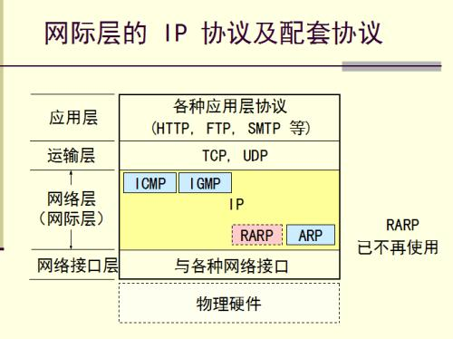

# 网络层

### 网络层提供的两种服务

##### 虚电路服务

- 传统电信网提供电话服务，用面向连接的通信方式，提供可靠的传输服务。
- 当两个计算机进行通信时，应当先建立服务（在分组交换中是建立一条虚电路），然后双方沿着已建立的虚电路发送分组。

##### 数据报服务

- 因特网采用的设计思路是：**网络层向上只提供简单灵活的、无连接的、尽最大努力交付的数据报服务** 。
- 网络在发送分组时不需要先建立连接，每一个分组独立发送，与前后的分组无关。因此，**网络层不提供服务质量的承诺** 。所传送的分组可能出错、丢失、重复和失序，不保证分组交付的时限。

##### 总结

- 因为电信网的终端（电话机）非常简单，没有智能，也没有差错处理能力，所以使用虚电路服务；但是计算机网络的端系统是有智能的计算机，计算机有很强的差错处理能力，使用数据报服务能获得更大的灵活性。

### 网际协议IP

- 网际协议是TCP/IP体系中两个最主要的协议之一，与之配套使用的有三个协议：
  - **地址解析协议ARP**。
  - **网际控制报文协议ICMP**。
  - **网际组管理协议IGMP**。
- 在这一层仲，ARP画在最下面，因为IP经常要使用这个协议。ICMP和IGMP画在这一层上面，因为它们要使用IP协议。

##### 分类的IP地址

- IP地址的编址方法共经过了三个历史阶段。
  1. **分类的IP地址**。这是最基本的编址方法。
  2. **子网的划分**。这是对最基本的编址方法的改进。
  3. **构成超网**。这是比较新的无分类编址方法。
- 所谓“分类的IP地址”就是将IP地址划分为若干个固定类，每一类都有两个固定长度的字段组成。
  - 第一个字段是**网络号** ，它标志着主机（或路由器）所连接到的网络。一个网络号在整个因特网范围内必须唯一。
  - 第二个字段是主机号，它标志该主机。一个主机号在它前面的网络号所指明的网络范围内必须是唯一的，由此可见，一个IP地址在整个因特网范围内是唯一的。

##### 地址解析协议ARP

- 地址解析协议的作用是：**通过IP地址找出其相应的硬件地址**。
- 传送ARP分组使用是IP协议，但ARP协议的用途是为了从网络层使用的IP地址解析出在数据链路层使用的硬件地址。
- **地址解析协议ARP在主机ARP高速缓存中存放一个从IP地址到硬件地址的映射表，并且这个映射表经常动态更新（新增或超时删除）**。
- 当主机A要向本局域网上某个主机B发送IP数据报，就先在其ARP高速缓存仲查看有无主机B的IP地址。
  - 如有，就在ARP高速缓存中查出其对应的硬件地址，并将其写入MAC帧。
  - 如果没有，就使用ARP找出主机B的硬件地址。
- 寻找方式：
  1. ARP进程在本局域网上广播发送一个ARP请求分组，其内容是自己的IP地址和硬件地址，以及要寻找的IP地址。
  2. 主机B的IP地址与ARP请求分组中要查询的IP地址一致时，就收下这个ARP请求分组，并向主机A发送ARP响应分组。（使用单播发送）
  3. 主机A收到主机B的ARP响应分组后，就在其ARP高速缓存中写入主机B的IP地址到硬件地址的映射。

##### IP数据报的格式

- [IP报文格式](TCP、UDP以及IP报文格式.md)

##### 划分子网

- 划分子网的方式是从网络的主机号借用若干位作为子网号，当然主机号也相应减少了同样的位数。于是两级IP地址在本单位内部就变为三级IP地址：网络号、子网号和主机号。
- 路由器使用**子网掩码**来划分子网。

##### 无分类编址CIDR(构成超网)

- CIDR最主要的特点有两个：
  1. CIDR消除了传统的A类、B类和C类地址以及划分子网的概念。
     - CIDR把32位的IP地址划分为两个部分，前面的部分是“网络前缀”，后面的部分是主机号。
  2. CIDR将网络前缀都相同的连续的IP组成一个“CIDR地址块”。
- 为了更方便的进行路由选择，CIDR使用32位的地址掩码，也可继续成为子网掩码，使用斜记法（如/20）。

##### 网际控制报文协议ICMP

- ICMP报文的种类有两种：**ICMP差错报告报文**和**ICMP询问报文**。
- ICMP差错报文共有五种：
  1. **终点不可达**。
     - 当路由器或主机不能交付数据报时就向源点发送终点不可达报文。
  2. **源点抑制**。
     - 当路由器或主机由于拥塞而丢弃数据报时，就向源点发送源点抑制报文，使源点知道应当把数据报的发送速率放慢。
  3. **时间超过**。
     - 当路由器收到生存时间为零的数据报时，除丢弃该数据报外，还要向源点发送时间超时报文。
     - 当终点在预定规定的时间内不能收到一个数据报的全部数据报片时，就把已收到的数据报片都丢弃，并向源点发送时间超过报文。
  4. **参数问题**。
     - 当路由器或目的主机收到的数据报的首部中有的字段的值不正确时，就丢弃该数据报，并向源点发送参数问题报文。
  5. **改变路由（重定向）**
     - 路由器把改变路由报文发送主机，让主机知道下次应将数据报发送给另外的路由器（可通过更好的路由）。
- 常用的ICMP询问报文有两种：**回送请求和回答**和**时间戳请求和回答**。
- ICMP使用例子：PING使用了ICMP回送请求与回送回答请求。traceroute（tracert）命令。